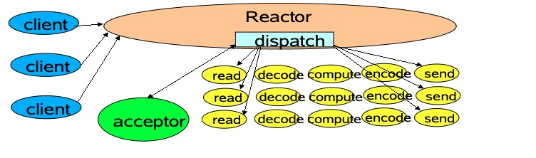
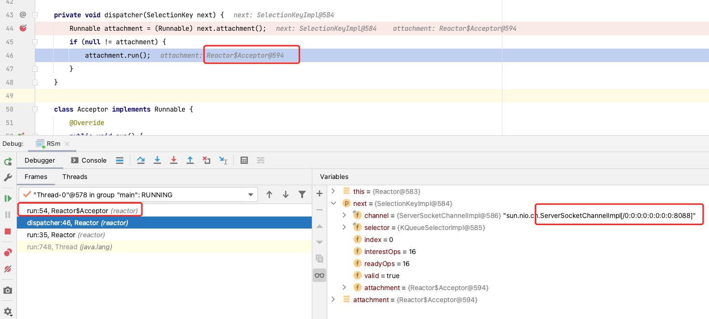
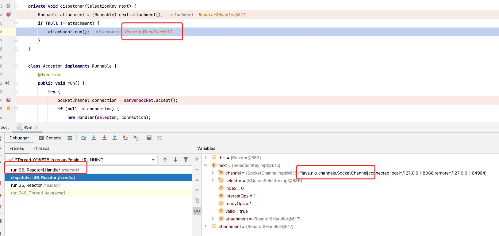

# Single

## [单线程版本](https://github.com/sona0402/netty/commit/9bf11da99190cdbe8b6e19cb4a2859f8996d8823)



如图所示， `Reactor 模式` 的 `acceptor(listenfd)` 和 `read decode compute encode send` 在一个线程中，也就是 `listenfd` 和 `connectionfd` 在一个线程， `redis server` 其底层也是单线程 `Reactor` ，所有我们需要研究下这个模式。

### 安装

```java
Reactor(int port) throws IOException {
    selector = Selector.open();
    serverSocket = ServerSocketChannel.open();
    serverSocket.socket().bind(new InetSocketAddress(port));
    serverSocket.configureBlocking(false);
    SelectionKey sk =serverSocket.register(selector,SelectionKey.OP_ACCEPT);
    sk.attach(new Acceptor());
}
```

[rocketmq line 147](https://github.com/apache/rocketmq/blob/master/store/src/main/java/org/apache/rocketmq/store/ha/HAService.java#L168)

```java
 public void beginAccept() throws Exception {
      this.serverSocketChannel = ServerSocketChannel.open();
      this.selector = RemotingUtil.openSelector();
      this.serverSocketChannel.socket().setReuseAddress(true);
      this.serverSocketChannel.socket().bind(this.socketAddressListen);
      this.serverSocketChannel.configureBlocking(false);
      this.serverSocketChannel.register(this.selector, SelectionKey.OP_ACCEPT);
}
```

多线程还是单线程都使用的都是同一个 `listenfd` 所以代码基本一致，而且 `ServerSocketChannel` 只关注 `accept` 事件。

### 线程循环

```java
  public void run() {  // normally in a new Thread
      try {
        // 如果当前线程没有被中断
        while (!Thread.interrupted()) {
          // 使用选择器查找准备好的事件
          selector.select();
          // 这里做处理的时候时间可能是ServerSocketChannle或者SocketChannle
          Set selected = selector.selectedKeys();
          Iterator it = selected.iterator();
          while (it.hasNext())
             // 只有要事件发生就进行处理
             dispatch((SelectionKey)(it.next());
          selected.clear();
          }
  } catch (IOException ex) { /* ... */ }
  }
void dispatch(SelectionKey k) {
  Runnable r = (Runnable)(k.attachment()); if (r != null)
}
```

1. 当前线程进行循环，查看是否有事件发生
2. 有事件发生则处理事件
3. 如果`attachment = Acceptor`产生一个新的`SocketSocket`。
4. 如果`attachment = Handler`进行读写处理。

### 连接器

```java
  class Acceptor implements Runnable { // inner
      public void run() {
        try {
          SocketChannel c = serverSocket.accept();
          if (c != null)
            new Handler(selector, c);
        catch(IOException ex) { /* ... */ }
      }
    }
  }
}
```

当 `SelectKey` 的 `channel` 为 `ServerSocketChannel` 时，因为 `attachment=Acceptor` ，每次被都会产生一个新的 `SockectChannel` ，其会被包装成 `Handler` 。



### 处理器

```java
Handler(Selector sel, SocketChannel c) throws IOException {
    socket = c; c.configureBlocking(false);
    // Optionally try first read now
    sk = socket.register(sel, 0);
    sk.attach(this);
    sk.interestOps(SelectionKey.OP_READ);
    sel.wakeup();
}
```

`Handler`初始化时，会向 `Selector` 注册自己，并将 `Handler` attach 到 `SelectKey` 上。

### 处理器处理请求

`SelectKey` 的 `channel` 为 `SocketChannel` 时，因为 `attachment=Handler` ，根据事件进行数据处理。



## 总结

`Reactor模型`核心在于 attach 上，会根据 attch 的不同对象类型，进行不同处理。

* SelectKey = Selector + ServerSocketChannel + Acceptor
* SelectKey = Selector + SocketChannel + Handler
