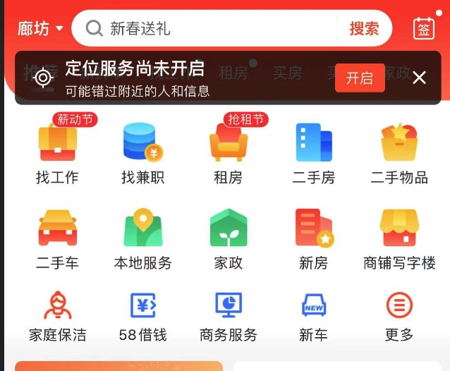

# 高并发设计

之前一直思考高并发是什么？为什么一面试就要问“八股文”，其实笔者到现在也不会“八股文”，2021年04月对58首页门户金刚位进行重写，在此期间对项目思考了很多，[为什么要重写？](../README.md#个人经历)，本次借用本篇文章写一下自己见解，有写的不对的地方敬请见谅。

58首页门户金刚位是什么？就是图中这个东西，看起来好像没什么复杂，看起来确实不复杂。如果图中数据是静态页面（h5页面、客户端内置）确实不复杂。

::: center
本图为58App首页金刚区
:::

## 需求

1. 业务上有以下诉求：
   * 支持多维度（城市、平台、版本）下后台配置（App发版困难，所以需要支持后台配置）；
   * icon图标分为多种类型（大、小、个性化等）；
   * 角标配置（红点、文字、lottile等）；
   * 需要支持临时运营配置（icon图片、跳转协议、名称），也就是每一个icon的在多维度配置内的情况下属性需要支持特定时间替换；
   * 某些位置需要支持个性化推荐，对接推荐系统；
   * 支持自动化测试；
   * 无charles代理在手机端看到展示效果。
2. 技术上有请求耗时低、并发大诉求。

## 总结

从整体诉求来看，项目设计有两个方向：业务设计（抽象、可扩展性）、技术设计（耗时低、并发大、安全）。

<!-- ## 单机器

单机器，需要考虑什么呢？其实“八股文”已经告诉我们了，那就是代码、虚拟机、框架、中间件。

### 代码

选择面向对象语言还是面向过程语言？面向过程语言在调用函数时都是有性能损耗的，那面向对象语言在动态链接时对性能损耗更高。 -->
