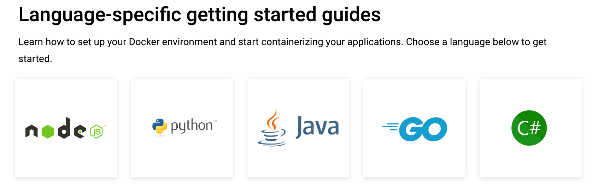

# docker support language

`docker` 现以支持多种语言部署，[官方文档](https://docs.docker.com/language/)，支持语言如图所示：

对于后端来讲，多种语言只需要暂时先熟悉一种即可，因为其总体结构分为单体无数据库应用打包部署，连接数据库应用打包和数据库打包。

## [java应用启动](https://docs.docker.com/language/java/)

原文内容如下：
Java 入门指南教您如何使用 Docker 创建容器化的 Spring Boot 应用程序。在本模块中，您将学习如何：

* 使用 Maven 克隆并运行 Spring Boot 应用程序
* 创建一个新的 Dockerfile，其中包含构建 Java 映像所需的指令
* 将新建的镜像作为容器运行
* 设置本地开发环境以将数据库连接到容器
* 使用 Docker Compose 运行 Spring Boot 应用
* 使用 GitHub Actions 为您的应用程序配置 CI/CD 管道
* 将您的应用程序部署到云端
完成 Java 入门模块后，您应该能够根据本指南中提供的示例和说明将您自己的 Java 应用程序容器化。

## 问题

1. 解决查找`OpenJDK`问题，并在不同环境配置（win2012）不生效问题，本着客户需求之上原则，满足客户有的服务器是linux，有的是win2012。
2. 解决`Mysql`安装缺失依赖问题，在之前部署服务器（win2012），缺少各种dll。
3. 客户不提供linux环境，跳板机需要使用向日葵，mac使用向日葵打字不兼容问题。
4. 服务器被攻击无法使用常规命令进行排查，需要查看win命令，并对top等兼容性不好问题。

## 总结

使用`docker`其实就是程序员为自己节省时间（上面问题浪费很多时间），减少出错的概率和排查错误耗费的时间。
