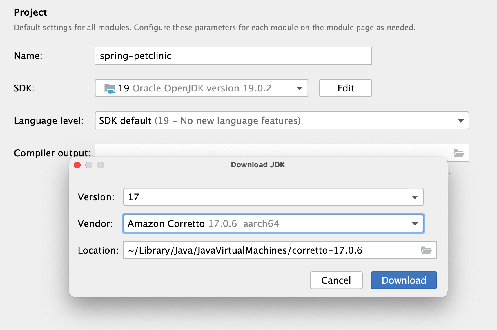
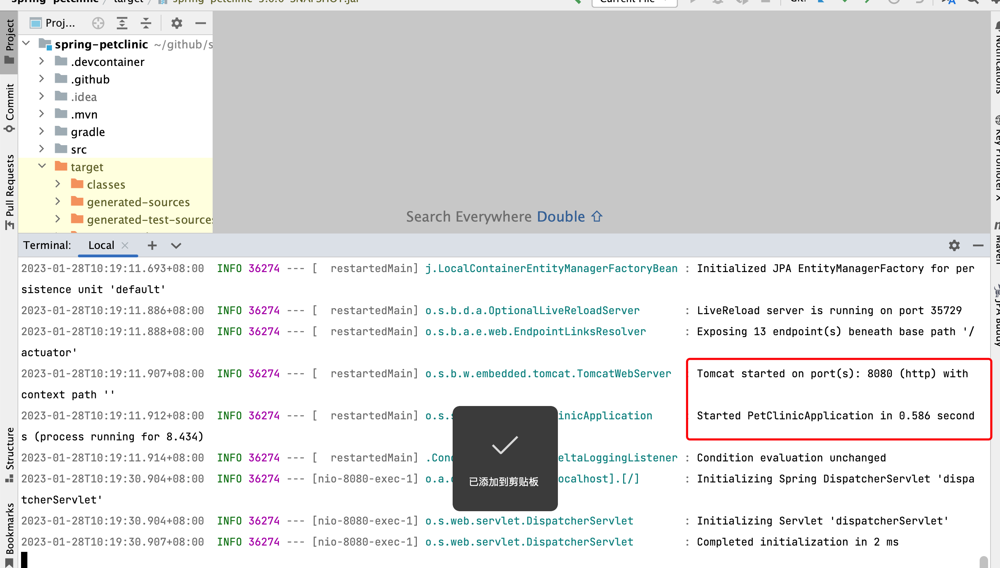
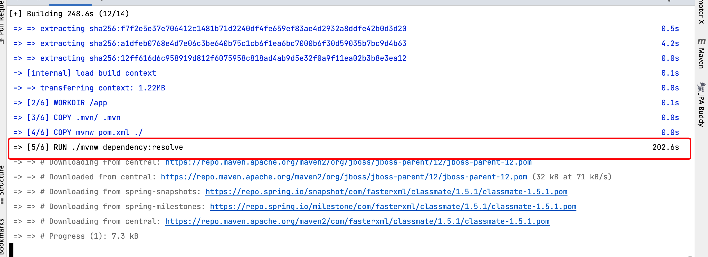
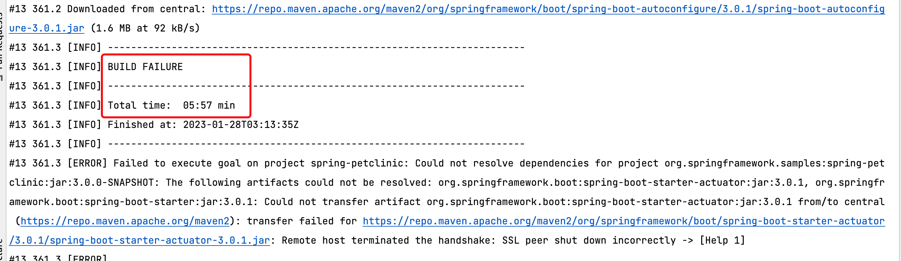

# docker镜像构建

## 准备

学习docker基本概念、dockerfile语法和机器上启动了BuildKit。

## 概述

要部署一个java项目，需要java二进制文件、需要的依赖、系统文件等。

1. docker，打包使用。
2. Git客户端，拉取代码使用。
3. 文本编译器，编写代码使用。

```sh
// 这里是你要保存项目的文件夹
cd /path/to/working/directory
// 克隆项目
git clone https://github.com/spring-projects/spring-petclinic.git
// 切换文件夹
cd spring-petclinic
```

## 测试项目

本地不使用docker进行测试，项目要求使用OpenJDK15或者15以后版本，可以官网下载，官网需要登陆，很麻烦，直接使用idea提供的工具进行下载。



使用了mvn-wrapper，此方案好处在于不需要配置mvn环境，缺点在于每次都需要将依赖拉取一遍，比较耗时，解决此问题的方案可以搭建私服。

```sh
// 运行项目
./mvnw spring-boot:run
```



## 创建Dockerfile

1. 拉取基础镜像，这里需要拉取OpenJDK；

``` text
# syntax=docker/dockerfile:1
FROM eclipse-temurin:17-jdk-jammy
```

2. 创建工作文件夹；

``` text
WORKDIR /app
```

3. 解决依赖问题，将依赖关系pom文件和mvn-wrap复制到容器中；

```text
COPY .mvn/ .mvn
COPY mvnw pom.xml ./
```

4. 下载依赖；

```text
RUN ./mvnw dependency:resolve
```

从图中看到下载依赖时间很长，建议使用私服解决此问题。


5. 复制源代码

```text
COPY src ./src
```

6. 启动服务

```text
CMD ["./mvnw", "spring-boot:run"]
```

7. 查看完整的dockerfile

```text
# syntax=docker/dockerfile:1

FROM eclipse-temurin:17-jdk-jammy

WORKDIR /app

COPY .mvn/ .mvn
COPY mvnw pom.xml ./
RUN ./mvnw dependency:resolve

COPY src ./src

CMD ["./mvnw", "spring-boot:run"]
```

## 常用

使用上述方案打包处理，会出现耗时长，并且打包失败问题。



打镜像的时候，都是本地打好包，然后添加到镜像中，并用`java -jar`启动，在启动时添加`jvm`参数。

```text
// 拉取基础镜像
FROM openjdk:12-alpine
// 复制可启动包
ADD /target/*.jar /app.jar
// 进行启动
ENTRYPOINT ["sh", "-c", "java  -jar /app.jar]

EXPOSE 8080
```

## 镜像打tag

此问题主要是解决线上版本有问题，可以快速回滚上一版本镜像保证服务可用。
