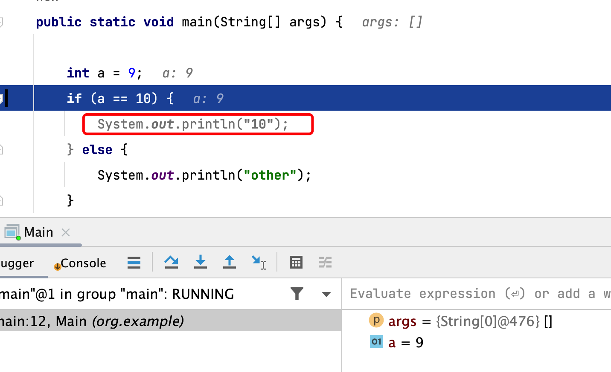
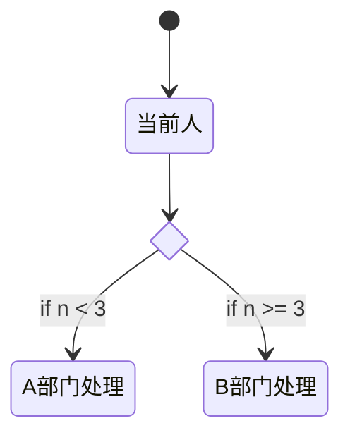
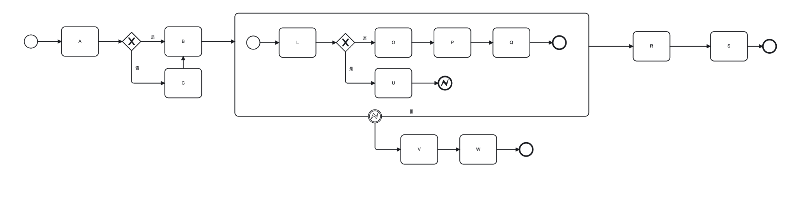
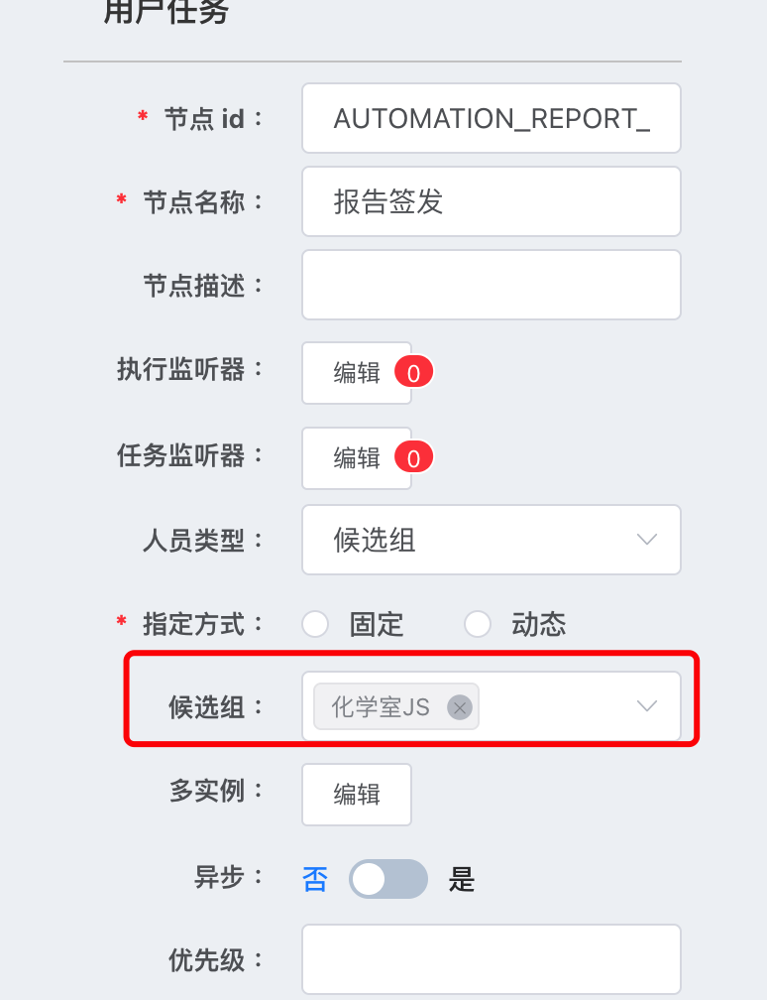

# 权限+流程

<!-- 权限可以参考[周志明老师架构安全性](https://jingyecn.top:18080/architect-perspective/general-architecture/system-security/)， -->
<!-- 框架组合使用在某些场景下就会产生新的问题。 -->

## 下一流程

讲点技术相关的，词法分析树可以分析出流程树，也可以进行预测，详细内容参考[编译原理](https://book.douban.com/subject/3296317/)，笔者只是大概翻了翻目录，进行了解了一下，idea已经支持根据当前数据进行推断代码执行，图中可以看出已经根据当前标量进行推断出下一分支执行，此段代码仅做展示使用，在编译期间会优化掉不会执行的分支。



工作流中有一种场景就是获取下一个流程，即根据当前页面的值动态的获取下一个页面流程，然后当前人会根据下一流程选取不同人做处理，并且流程上处理人员不一样。



工作流程获取下一流具体详情如下，代码参考了[zhoupeng20188](https://github.com/zhoupeng20188/activitispringboot/blob/master/src/main/java/com/zp/activitispringboot/utils/ActivitiUtil.java)，这里很复杂，涉及到子流程获取下一流程问题以及一些未知问题（对bpmn使用还少），所以这里只能做到暂时业务可以获取，短时间内很难穷举出所有case。


## 页面问题

::: tip
bpmn [工具使用](https://camunda.com/download/modeler/)
:::



一个大的流程中，如上图所示，会有很多页面看起来差不多，如果使用一个页面控制就会导致在待办跳转后当前页面该不知道该显示什么值问题，如果使用多个页面进行处理，会出现很多重复代码，笔者处理的一个流程大概12+个页面需要局部调整，即使使用模版设计模式，在改动时依然会出现遗漏。Java 下的模版设计模式在解决这个问题就会好很多，大概是笔者 vue 功力不够。

## 获取流转人

### 使用工作流自带角色

工作流中配置角色，流转时查询角色，在查询需要流转的人，在使用上是没有问题的，但是在配置上会出现二次操作问题，创建角色后需要用户来流程图中配置角色，普通用户对此又不太明白。



### 根据组织架构获取流转人

考虑到跨部门协作问题，下一节点需要流转的人可能会是其他部门的人，当时想是否从当前人向上找两级（一级是本小组）即可满足要求，这样也可以动态的获取人员。

### 根据页面获取流转人

找到了下一工作流节点，根绝节点找到跳转路由(每一个节点都配置跳转路由供首页跳转使用)，现可以根据页面路由查找到拥有该页面的角色。

```sql
select role_id from url_permission where permission = '页面路由'
```

根据角色查找到角色下所有人。

```sql
select user_id from role_dis where role_id = 'xxx'
```

根据找到的人在找到其部门和父亲部门，构建组织架构树，这里需要[树](https://github.com/rfk1118/leetcode/blob/main/markdown/binary_tree.md)的算法和组合设计模式，此时更加理解算法的重要性。

## 进阶版

* Jvm可以根据长期调用对字节码编译进行优化和退化，基于预期，并且有衰退。
* 业务上在`O - > Q`节点上，假如部门A的A1流转给B部门的B1，部门A的A2流转给B部门的B2，则业务上下次A1进行流转时，需要进行提示B1，如果A1后面3次流转人员都是C1，然后下次又改成A1，应该提示什么？

## 参考

* [flowable doc](https://documentation.flowable.com/latest/index.html)
* [tony / RuoYi-flowable](https://gitee.com/tony2y/RuoYi-flowable)
* [周志明老师架构安全性](https://jingyecn.top:18080/architect-perspective/general-architecture/system-security/)
* [工具使用](https://camunda.com/download/modeler/)
* [zhoupeng20188 nextFlow](https://github.com/zhoupeng20188/activitispringboot/blob/master/src/main/java/com/zp/activitispringboot/utils/ActivitiUtil.java)
* [龙书编译原理](https://book.douban.com/subject/3296317/)
