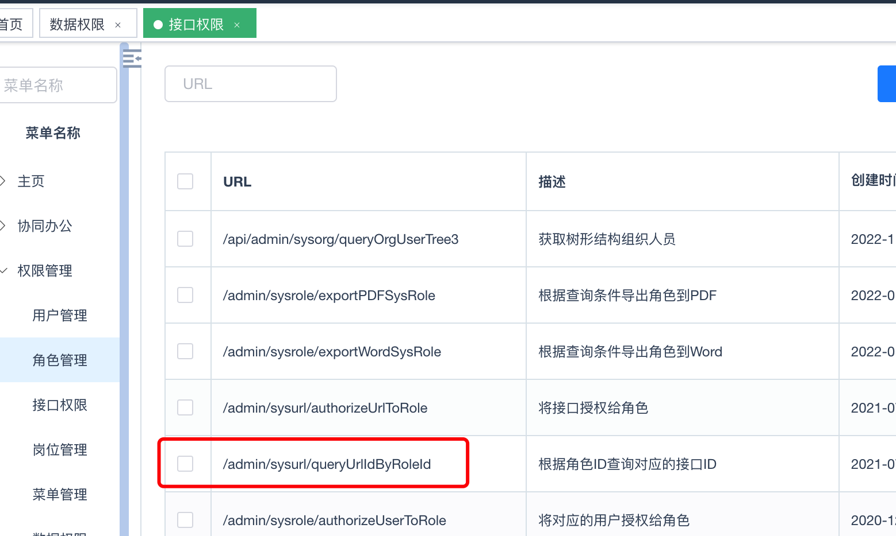
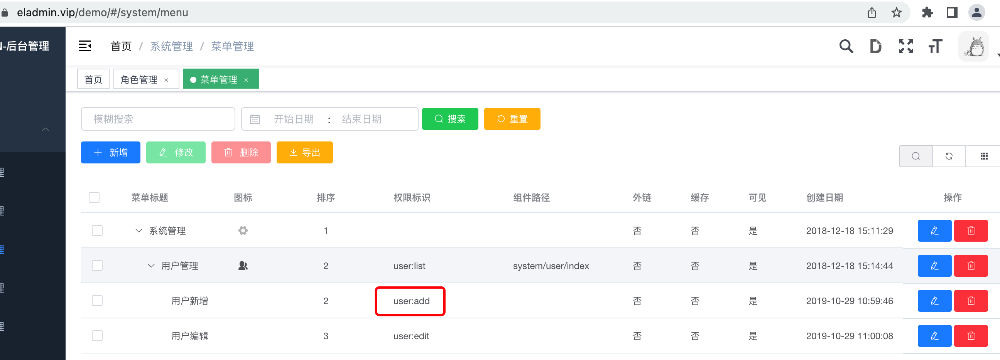

# RBAC

用户m和可操作功能n组合，会产生c(m,n)种可能，所以这里需要粘合层进行转接，业内也是这么做的。

* 数据库表的crud对应用户操作，也是基于角色分配和控制的。
* flowable也是m元素配置时可以连接或者后续可以连接用户。

角色就是中间层，关于用户-角色-操作具体操作后续讲解数据库设计的时候在进行讲解。
后续主要讲解关于操作相关。

## 接口权限

作为赏金猎人帮助朋友维护系统时，发现某系统权限URL被拆分出来单独对待，并放在某一个模块下。如下图所示：



让我们思考一个问题，那就是开发人员看到密密麻麻的接口能配置正确吗？如果不能的话，如何能保证运营管理员配置正确？

## 推导

孤立URL是没有意义的，用户关心的就是页面、按钮，不会关心接口，在此基础上进行思考是不是URL应该挂在页面或者按钮级别。
来看开源框架，例如[ruoyi](https://ruoyi.vip/)、[eladmin](https://eladmin.vip/demo/#/dashboard)、[diboot](http://demo.diboot.com/user/login)等都是基于页面和按钮进行配置的。如图所示：



代码层面可以[参考eladmin官方文档](https://eladmin.vip/pages/010202/#%E6%9D%83%E9%99%90%E6%8E%A7%E5%88%B6)，使用了`Spring Security`中`Spring EL`进行切面处理，可以让用户无需过多关注权限安全相关。参考代码如下：

```java
@Log(description = "修改菜单")
@PutMapping(value = "/menus")
@PreAuthorize("hasAnyRole('admin','menu:edit')")
public ResponseEntity update(@Validated @RequestBody Menu resources){
    // 略
}
```

## 总结

为什么要思考`rbac`，为什么要去看这些脚手架，在之前相关功能都由其他同进行负责，现在作为赏金猎人存在，需要更多的考虑如何快速的从` 0～1 `搭建项目，如何找到稳定的脚手架。
朋友买的项目因为开发了很多功能，迁移又迁移不动，维护成本又高，系统安全问题还多。
建议大家如果精力不多的话一定要使用知名度高的开源框架，如果公司比较大，就可以自定义开发了，因为开源知名度高的软件也是被查找漏洞的目标对象。
后续讲解下`rbac + flowable`下产生的业务难题。
