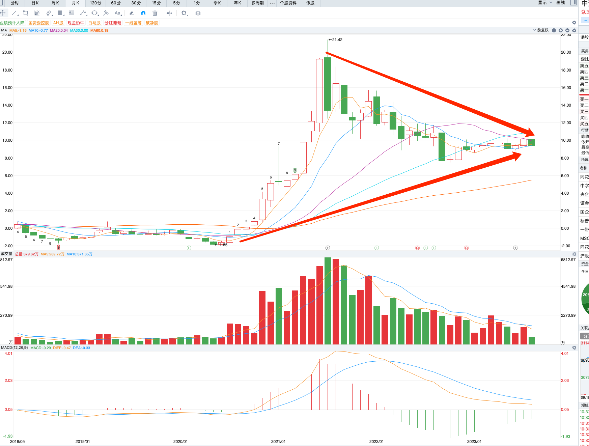
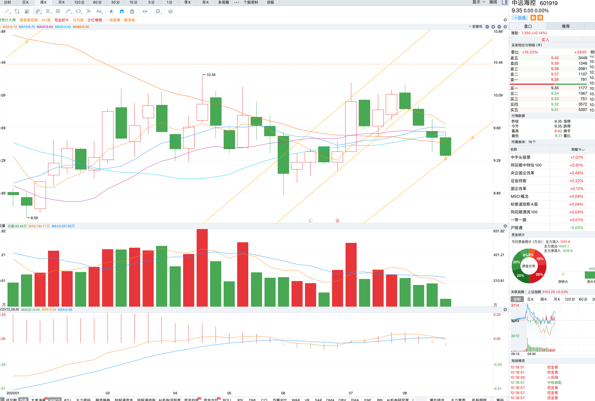
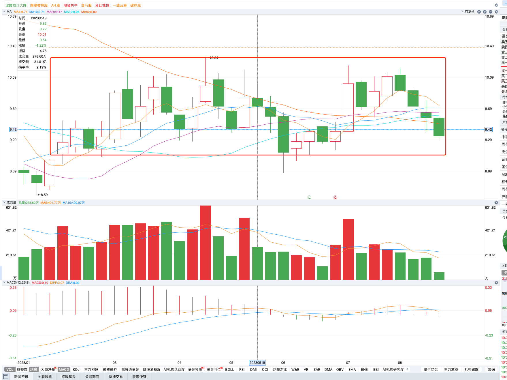
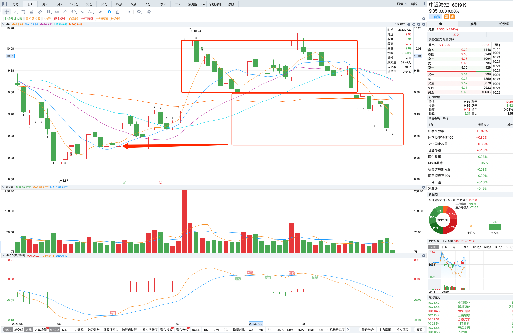
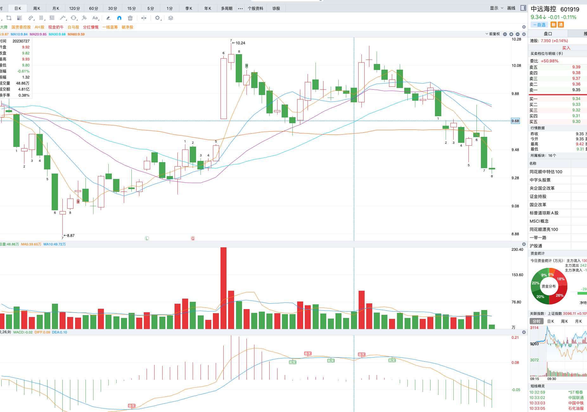
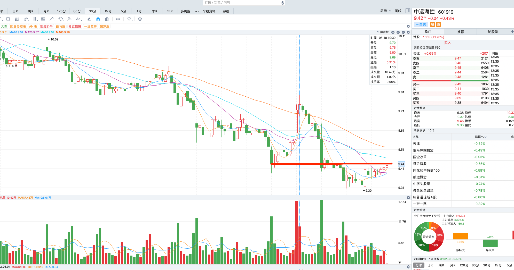

# 中远海控

2022年8月31日买进601919之后一直被套，每日进行复盘进行悟道。

## 月线

从月线级别看，`macd`绿柱在收缩，当回到0轴是上行还是继续绿柱？

## 周线

周线级别之前有个上行通道，但是已经跌破，现在已经走了了另外一个通道的底部。

## 日线

日线级别，还在一个大的通道内，

## 犯错

前几日跌破短期通道，情感坚信能够抗住，舍不得割肉。

## 20230822

今天暂时收了探水杆，西方经济叫做反转日。是否还会继续下探呢？后续观察周线通道下沿还是日线级别通道下沿那个更准一些呢？也许是随机性。

## 20230823

今日港股盘中上涨1.75%，601919上涨0.43%，现来到了前支撑，看是否能突破抵挡。

