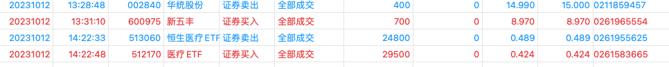

# 猪肉股

长期潜伏在猪肉股，但是吃了天康的大坑之后，悟出了一些道理，那就是高切低的时候如果没有好的标的那就切etf。

猪肉板块的走势大概分为两种，防守和进攻，

* 防守：牧原、天康、唐人神、etf
* 进攻：巨星，华统，新五丰

## 20231013

二次冲高滞涨，切`300498`失败，未开通创业板，其他标地`牧原、天康、唐人神、etf`等走势很弱，而且天康跌的时候比etf还能跌，个人是有板块内高切低习惯的，所以此次犯错了。
看明天交易如何。
