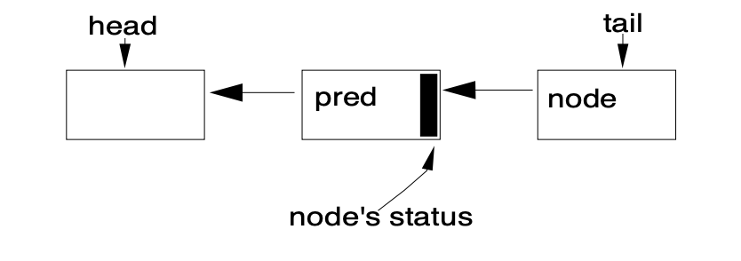

# CLH

框架的核心是维护被阻止线程的队列，这些队列在这里仅限于FIFO队列。因此，该框架不支持基于优先级的同步。

如今，几乎没有争议，同步队列最合适的选择是非阻塞数据结构，这些结构本身不需要使用较低级别的锁构建。其中，有两个主要候选者：Mellor-Crummey和Scott（MCS）锁的变体[9]，以及Craig、Landin和Hagersten（CLH）锁的变体[5][8][10]。从历史上看，CLH锁只用于自旋锁。然而，它们似乎比MCS更适合在同步器框架中使用，因为它们更容易适应处理取消和超时，因此被选为基础。由此产生的设计与原始CLH结构相去甚远，需要解释。

CLH队列不是很像队列，因为它的排队和排队操作与其作为锁的用途密切相关。这是一个链接队列，通过头部和尾部这两个原子可更新的字段访问，这两个字段最初都指向一个虚拟节点。

使用原子操作排队新节点，节点：

```java
do {
  pred = tail;
} while(!tail.compareAndSet(pred, node));
```

每个节点的发布状态都保留在前一个节点中。因此，旋转锁的“旋转”看起来像：

```java
while (pred.status != RELEASED) ; // spin
```

旋转后的队列操作只需将头部字段设置为刚刚获得锁的节点：`head = node;`

CLH锁的优点之一是进队和出队速度快、无锁、无阻塞（即使在争用下，一个线程也总是会赢得插入比赛，因此会取得进展）；检测是否有线程在等待也很快（只需检查头部是否与尾部相同）；释放状态是分散的，避免了一些内存争用。

在原始版本的CLH锁中，甚至没有连接节点的链接。在自旋锁中，pred变量可以作为本地变量保存。然而，Scott和Scherer[10]表明，通过在节点内显式维护前身字段，CLH锁可以处理超时和其他形式的取消：如果节点的前身取消，节点可以向上滑动以使用上一个节点的状态字段。

使用CLH队列阻止同步器所需的主要额外修改是为一个节点定位其后续节点提供高效方式。在自旋锁中，节点只需要更改其状态，其继任者下次旋转时会注意到这一点，因此链接是不必要的。但在阻塞同步器中，节点需要显式唤醒（取消停用）其继任者。

`AbstractQueuedSynchronizer`队列节点包含其后续节点的下一个链接。但是，由于没有使用 `compareAndSet` 对双链路列表节点进行无锁原子插入的适用技术，因此此链接不是作为插入的一部分进行原子设置的；它只是分配：

```java
pred.next = node;
```

插入后。这反映在所有用法中。下一个链接仅被视为优化路径。如果节点的继承者似乎没有通过下一个字段存在（或似乎被取消），则始终可以从列表的尾部开始，并使用预置字段向后遍历，以准确检查是否真的有一个。

第二组修改是使用每个节点中保存的状态字段来控制阻塞，而不是旋转。在同步器框架中，排队的线程只有在传递具体子类中定义的`tryAcquire`方法时才能从获取操作返回；单个“释放”位是不够的。但仍然需要控制，以确保活动线程只有在队列首时才允许调用`tryAcquire`；在这种情况下，它可能无法获取和（重新）阻止。这不需要每个节点的状态标志，因为可以通过检查当前节点的前身是头部来确定权限。与自旋锁的情况不同，没有足够的内存争用读取头来证明复制。但是，取消状态必须仍然存在于状态字段中。

队列节点状态字段还用于避免不必要的`park`和`unpark`调用。虽然这些方法随着阻塞原语的速度相对较快，但它们在Java和JVM运行时和/或操作系统之间的边界交叉中遇到了可避免的开销。在调用`park`之前，线程会设置`signal me`位，然后在调用`park`之前再次重新检查同步和节点状态。释放线程清除状态。这避免了线程不必要地试图频繁地阻止以获得价值，特别是对于锁类来说，在这些类中，等待下一个符合条件的线程获取锁的时间会加剧其他争用效果。这也避免了要求释放线程来确定其继任者，除非继任者设置了信号位，这反过来又消除了它必须遍历的情况多个节点，以处理一个明显为空的下一个字段，除非与取消一起发生信令。

也许同步器框架中使用的CLH锁的变体与其他语言中使用的锁之间的主要区别在于，垃圾收集来管理节点的存储回收，从而避免了复杂性和开销。然而，对GC的依赖仍然意味着在肯定永远不会需要链接字段时取消链接字段。这通常可以在排队时完成。否则，未使用的节点仍然可以访问，导致它们无法收集。

J2SE1.5版本的源代码文档描述了一些进一步的小调优，包括第一次争用时CLH队列所需的初始虚拟节点的惰性初始化。

省略了这些细节，由此实现基本获取操作的一般形式（仅限独家、不间断、不定时的情况）是：

```java
if (!tryAcquire(arg)) {
  node = create and enqueue new node;
  pred = node's effective predecessor;
  while (pred is not head node || !tryAcquire(arg)) {
    if (pred's signal bit is set)
      park();
    else
    compareAndSet pred's signal bit to true;
    pred = node's effective predecessor;
  }
  head = node;
}
```

释放操作是：

```java
if (tryRelease(arg) && head node's signal bit is set) {
  compareAndSet head's signal bit to false;
  unpark head's successor, if one exists
}
```

当然，主获取循环的迭代次数取决于`tryAcquire`的性质。否则，在没有取消的情况下，获取和释放的每个组件都是恒定时间O（1）操作，跨线程摊销，忽略了`park`内发生的任何操作系统线程调度。

取消支持主要需要检查每次从收购循环中的`park`返回时是否有中断或超时。因超时或中断而取消的线程设置其节点状态并取消停放其后续线程，以便它可以重置链接。在取消时，确定前身和继任者以及重置状态可能包括O（n）遍历（其中n是队列的长度）。由于线程永远不会再次阻止已取消的操作，链接和状态字段往往会快速恢复稳定。

## 节点信息

CLH 队列不是很像队列，因为它的入队和出队操作与其作为锁的用途密切相关。它是一个链接队列，通过两个原子可更新字段 `head` 和 `tail` 访问，它们最初都指向一个虚拟节点。



```java
 static final class Node {

        // 共享模式
        static final Node SHARED = new Node();
        // 独占模式
        static final Node EXCLUSIVE = null;
        // 取消状态
        static final int CANCELLED =  1;
        // 表示需要唤醒
        static final int SIGNAL    = -1;
        // 阻塞等待
        static final int CONDITION = -2;

        // 值指示下一次获取 Shared 应该无条件传播
        static final int PROPAGATE = -3;

        volatile int waitStatus;

        // 前驱
        volatile Node prev;
        // 后继续
        volatile Node next;
        // 绑定线程
        volatile Thread thread;

        Node nextWaiter;

        final boolean isShared() {
            return nextWaiter == SHARED;
        }

        final Node predecessor() throws NullPointerException {
            Node p = prev;
            if (p == null)
                throw new NullPointerException();
            else
                return p;
        }

        Node() {    // Used to establish initial head or SHARED marker
        }

        Node(Thread thread, Node mode) {     // Used by addWaiter
            this.nextWaiter = mode;
            this.thread = thread;
        }

        Node(Thread thread, int waitStatus) { // Used by Condition
            this.waitStatus = waitStatus;
            this.thread = thread;
        }
    }
```

## 进队列

获取锁状态失败的时候，进入队列进行排队，涉及两段代码，分别为快速进队和循环进队列

1. 快速进队

```java
private Node addWaiter(Node mode) {
    Node node = new Node(Thread.currentThread(), mode);
    // Try the fast path of enq; backup to full enq on failure
    Node pred = tail;
    if (pred != null) {
        node.prev = pred;
        // 快速进队，如果其他线程已经进队，进行循环进队
        if (compareAndSetTail(pred, node)) {
            pred.next = node;
            return node;
        }
    }
    enq(node);
    return node;
}
```

2. 在快速进队失败的情况下，进行循环进队

```java
private Node enq(final Node node) {
    for (;;) {
        Node t = tail;
        if (t == null) { // Must initialize
            if (compareAndSetHead(new Node()))
                tail = head;
        } else {
            node.prev = t;
            if (compareAndSetTail(t, node)) {
                t.next = node;
                return t;
            }
        }
    }
}
```

## 出队列

1. 由于`head`是哑节点，所以在判断前驱为head的时候并且自己抢到锁，就可以出队了。

```java
final boolean acquireQueued(final Node node, int arg) {
    boolean failed = true;
    try {
        boolean interrupted = false;
        for (;;) {
            final Node p = node.predecessor();
            // 前驱为head，自己拿到锁
            if (p == head && tryAcquire(arg)) {
                // 持有锁线程出队
                setHead(node);
                p.next = null; // help GC
                failed = false;
                return interrupted;
            }
            if (shouldParkAfterFailedAcquire(p, node) &&
                parkAndCheckInterrupt())
                interrupted = true;
        }
    } finally {
        if (failed)
            cancelAcquire(node);
    }
}
```

2. 真实出队，把线程信息移除，拿到锁的线程已经不在队列中，头节点依然是哑节点

```java
private void setHead(Node node) {
    head = node;
    node.thread = null;
    node.prev = null;
}
```

## 总结

* 线程协作，当前持有锁的线程在释放锁的时候，唤醒后继节点
* 后继线程节点拿到锁的时候，出队

## 参考材料

* [Michael-Scott](.)

本算法主要是将线程如何协作的

* [Java并发编程实战 P273](https://book.douban.com/subject/10484692/)
