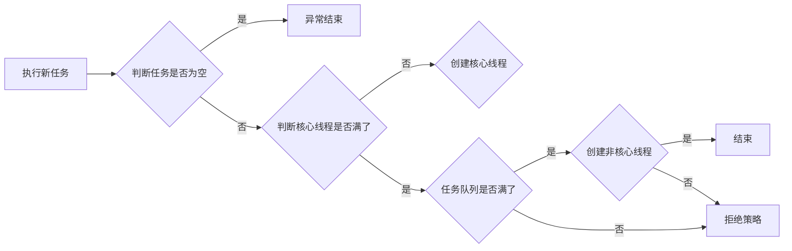
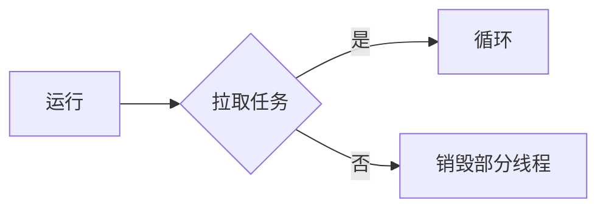

# ThreadPoolExecutor

## 概念

* 减少了每个任务的调用开销，它们通常在执行大量异步任务时提供改进的性能，并且它们提供了一种限制和管理资源的方法，包括执行集合时消耗的线程。
* 每个`ThreadPoolExecutor`还维护一些基本的统计信息，例如完成任务的数量。

线程池的初始化，最终都会调用到这个方法，核心参数如下文。

```java
public ThreadPoolExecutor(int corePoolSize,
                          int maximumPoolSize,
                          long keepAliveTime,
                          TimeUnit unit,
                          BlockingQueue<Runnable> workQueue,
                          ThreadFactory threadFactory,
                          RejectedExecutionHandler handler) {
    // 必要校验
    if (corePoolSize < 0 ||
        maximumPoolSize <= 0 ||
        maximumPoolSize < corePoolSize ||
        keepAliveTime < 0)
        throw new IllegalArgumentException();
    if (workQueue == null || threadFactory == null || handler == null)
        throw new NullPointerException();
    this.acc = System.getSecurityManager() == null ?
            null :
            AccessController.getContext();
    // 核心线程数量
    this.corePoolSize = corePoolSize;
    // 最大线程数量
    this.maximumPoolSize = maximumPoolSize;
    // 任务保存队列
    this.workQueue = workQueue;
    // 存活时间
    this.keepAliveTime = unit.toNanos(keepAliveTime);
    // 创建线程的工厂
    this.threadFactory = threadFactory;
    // 拒绝策略
    this.handler = handler;
}
```

### 核心和最大池大小

新来任务，如果核心线程没满的话，会先创建核心线程，如果核心线程满了，并且任务队列满了，创建非核心线程，如果`maximumPoolSize - corePoolSize = 0`执行拒绝策略

```java
 private volatile int corePoolSize;
 private volatile int maximumPoolSize;
```

### 创建新线程

线程的创建是使用`ThreadFactory`进行创建的，[详情请点击](./thread-factory.md)。

### 存活

核心线程是否允许超时和存活时间

```java
private volatile long keepAliveTime;

private volatile boolean allowCoreThreadTimeOut;
```

### 队列

`BlockingQueue`保存任务，也就是生产者和消费者的媒介，客户端向`Queue`中放任务，`Work`进行消费任务。

### 拒绝策略

`BlockingQueue`满时，可以选择不用的策略处理新任务。

### 数量和线程池状态

使用一个32位int代表两种状态，分别为状态和线程数量，高3位为状态，低29位为线程数量

```java
// 原子保存状态和数量
private final AtomicInteger ctl = new AtomicInteger(ctlOf(RUNNING, 0));
// 29位切割
private static final int COUNT_BITS = Integer.SIZE - 3;
// 最大容量
private static final int CAPACITY   = (1 << COUNT_BITS) - 1;

// runState is stored in the high-order bits
// 高3位不同状态
private static final int RUNNING    = -1 << COUNT_BITS;
private static final int SHUTDOWN   =  0 << COUNT_BITS;
private static final int STOP       =  1 << COUNT_BITS;
private static final int TIDYING    =  2 << COUNT_BITS;
private static final int TERMINATED =  3 << COUNT_BITS;

// Packing and unpacking ctl
// 获取运行状态
private static int runStateOf(int c)     { return c & ~CAPACITY; }
// 获取工作线程数量
private static int workerCountOf(int c)  { return c & CAPACITY; }
```

## 代码

### 执行任务



```java
 public void execute(Runnable command) {
        // 如果任务为空，丢出异常
        if (command == null)
            throw new NullPointerException();
        // 获取现在原子代表的状态
        int c = ctl.get();
        // 计算出工作线程数量，如果工作线程小于核心线程数量
        if (workerCountOf(c) < corePoolSize) {
            // 创建一个work
            if (addWorker(command, true))
                return;
            // 加入失败，获取新值
            c = ctl.get();
        }
        // 确定线程池运行状态
        if (isRunning(c) && workQueue.offer(command)) {
            int recheck = ctl.get();
            if (! isRunning(recheck) && remove(command))
                reject(command);
            else if (workerCountOf(recheck) == 0)
                addWorker(null, false);
        }
        // 走到这里代表corePoolSize满了，并且队列满了，创建非核心线程
        // 创建非核心线程成功，完成任务，否则拒绝任务
        else if (!addWorker(command, false))
            reject(command);
    }
```

### 创建Worker

线程增加启动流程

```java
private boolean addWorker(Runnable firstTask, boolean core) {
    retry:
    for (;;) {
        // 获取值
        int c = ctl.get();
        // 运行状态
        int rs = runStateOf(c);

        // 当前池状态不允许添加
        // 池已停止或有资格关闭，则此方法返回false
        if (rs >= SHUTDOWN &&
            ! (rs == SHUTDOWN &&
                firstTask == null &&
                ! workQueue.isEmpty()))
            return false;

        for (;;) {
            int wc = workerCountOf(c);
            // 这里core变量会判断到底与谁相比
            // 如果创建核心线程，不允许大于核心线程数量
            // 如果创建非线程判断最大线程
            if (wc >= CAPACITY ||
                wc >= (core ? corePoolSize : maximumPoolSize))
                return false;
            // 如果cas成功，线程数量变化
            if (compareAndIncrementWorkerCount(c))
                // 跳出循环
                break retry;
            c = ctl.get();  // Re-read ctl
            // 状态变化了，跳出本次循环
            if (runStateOf(c) != rs)
                continue retry;
            // else CAS failed due to workerCount change; retry inner loop
        }
    }

    // 线程启动
    boolean workerStarted = false;
    // 线程开始
    boolean workerAdded = false;
    Worker w = null;
    try {
        // 创建Worker
        w = new Worker(firstTask);
        // 真实线程
        final Thread t = w.thread;
        if (t != null) {
            // 线程不为空
            final ReentrantLock mainLock = this.mainLock;
            mainLock.lock();
            try {
                // 获取线程池状态
                int rs = runStateOf(ctl.get());
                // 判断池状态
                if (rs < SHUTDOWN ||
                    (rs == SHUTDOWN && firstTask == null)) {
                    // 线程已经启动了
                    if (t.isAlive()) // precheck that t is startable
                        throw new IllegalThreadStateException();
                    // 加入到workers
                    workers.add(w);
                    int s = workers.size();
                    // 修改最大池数量
                    if (s > largestPoolSize)
                        largestPoolSize = s;
                    workerAdded = true;
                }
            } finally {
                mainLock.unlock();
            }
            // 如果线程增加到线程池成功
            if (workerAdded) {
                // 开启线程
                t.start();
                // 线程开启成功
                workerStarted = true;
            }
        }
    } finally {
         // 如果启动失败的话，加入到失败列表
        if (! workerStarted)
            addWorkerFailed(w);
    }
    return workerStarted;
}

// 增加失败的时候进行处理
private void addWorkerFailed(Worker w) {
    final ReentrantLock mainLock = this.mainLock;
    mainLock.lock();
    try {
        // 移除现在线程
        if (w != null)
            workers.remove(w);
        // 修正work数量
        decrementWorkerCount();
        // 销毁
        tryTerminate();
    } finally {
        mainLock.unlock();
    }
}
```

### reject

拒绝策略，会使用多种策略进行处理，[详情](./rejected-execution-handler.md)

```java
final void reject(Runnable command) {
    handler.rejectedExecution(command, this);
}
```

### getTask

从线程池设置的队列中拉取任务，方法为`getTask`



```java
// 执行阻塞或定时等待任务，具体取决于当前配置设置，或者如果此工作人员由于以下任何原因必须退出，则返回 null：
// 1. 工作work超过 maximumPoolSize（由于调用 setMaximumPoolSize）。
// 2. 池停止。
// 3. 池关闭，队列为空。
// 4. 该worker等待任务超时，超时allowCoreThreadTimeOut || workerCount > corePoolSize在定时等待前后都会被终止（即allowCoreThreadTimeOut || workerCount > corePoolSize ），
// 如果队列非空，则该worker不是池中的最后一个线程。
private Runnable getTask() {
    boolean timedOut = false; // Did the last poll() time out?

    // 进行循环拿任务
    for (;;) {
        int c = ctl.get();
        int rs = runStateOf(c);
        // 池停止&&池关闭，队列为空
        if (rs >= SHUTDOWN && (rs >= STOP || workQueue.isEmpty())) {
            decrementWorkerCount();
            return null;
        }

        int wc = workerCountOf(c);

        // 允许核心线程超时，并且当前线程大于核心线程数量
        boolean timed = allowCoreThreadTimeOut || wc > corePoolSize;
         // 工作work超过maximumPoolSiz||该worker等待任务超时
        // 如果超过核心线程数量并且有超市未获取到任务
        if ((wc > maximumPoolSize || (timed && timedOut))
        // 线程数量大于1或者队列空
            && (wc > 1 || workQueue.isEmpty())) {
            // 修正线程数量
            if (compareAndDecrementWorkerCount(c))
                // 返回空，调用processWorkerExit
                return null;
            continue;
        }

        try {
            // 从阻塞队列获取一个任务
            Runnable r = timed ?
                workQueue.poll(keepAliveTime, TimeUnit.NANOSECONDS) :
                workQueue.take();
            // 返回任务
            if (r != null)
                return r;
            timedOut = true;
        } catch (InterruptedException retry) {
            timedOut = false;
        }
    }
}
```

### processWorkerExit

如果线程拉取不到任务，也就是不在执行`while (task != null || (task = getTask()) != null)`，会执行到`processWorkerExit`

```java
// 为垂死的工人进行清理和记账。 仅从工作线程调用。
// 除非设置了 completedAbruptly，否则假定 workerCount 已经被调整以考虑退出。
// 此方法从工作程序集中删除线程，并且如果由于用户任务异常而退出或如果少于 corePoolSize 工作人员正在运行或队列非空但没有工作人员，则可能终止池或替换工作人员。
private void processWorkerExit(Worker w, boolean completedAbruptly) {
    if (completedAbruptly) // If abrupt, then workerCount wasn't adjusted
        decrementWorkerCount();

    // 拿锁
    final ReentrantLock mainLock = this.mainLock;
    mainLock.lock();
    try {
        // work完成任务增加到线程池上
        completedTaskCount += w.completedTasks;
        // 从workers队列移除当前线程
        workers.remove(w);
    } finally {
        mainLock.unlock();
    }

    // 进行线程终结
    tryTerminate();

    int c = ctl.get();
    if (runStateLessThan(c, STOP)) {
        if (!completedAbruptly) {
            int min = allowCoreThreadTimeOut ? 0 : corePoolSize;
            if (min == 0 && ! workQueue.isEmpty())
                min = 1;
            if (workerCountOf(c) >= min)
                return; // replacement not needed
        }
        addWorker(null, false);
    }
}

private void decrementWorkerCount() {
    do {} while (! compareAndDecrementWorkerCount(ctl.get()));
}
// cas修改数量
private boolean compareAndDecrementWorkerCount(int expect) {
    return ctl.compareAndSet(expect, expect - 1);
}
```

### tryTerminate

```java
final void tryTerminate() {
    for (;;) {
        int c = ctl.get();
        // 如果运行状态返回
        if (isRunning(c) ||
            // 如果处理清理或者终结状态
            runStateAtLeast(c, TIDYING) ||
            // 终结状态队列不为空，等待下一次轮训
            (runStateOf(c) == SHUTDOWN && ! workQueue.isEmpty()))
            return;
        // 工作数量不为空
        if (workerCountOf(c) != 0) { // Eligible to terminate
            // 终结一个
            interruptIdleWorkers(ONLY_ONE);
            return;
        }

        final ReentrantLock mainLock = this.mainLock;
        mainLock.lock();
        try {
            // 线程为0走到这里，设置状态为TIDYING
            if (ctl.compareAndSet(c, ctlOf(TIDYING, 0))) {
                try {
                    // 什么都不处理，空方法
                    terminated();
                } finally {
                    // 修改状态为TERMINATED
                    ctl.set(ctlOf(TERMINATED, 0));
                    // 唤醒终结的条件队列
                    termination.signalAll();
                }
                return;
            }
        } finally {
            mainLock.unlock();
        }
        // else retry on failed CAS
    }
}


protected void terminated() { }


private void interruptIdleWorkers(boolean onlyOne) {
  final ReentrantLock mainLock = this.mainLock;
  mainLock.lock();
  try {
      // 如果只移除一次
      for (Worker w : workers) {
          // 迭代Worker
          Thread t = w.thread;
          if (!t.isInterrupted() && w.tryLock()) {
              try {
                  // 进行中断
                  t.interrupt();
              } catch (SecurityException ignore) {
              } finally {
                  w.unlock();
              }
          }
          // 如果为true终结1个
          if (onlyOne)
              break;
      }
  } finally {
      mainLock.unlock();
  }
}
```

## shutdown

线程的销毁主要是关闭线程池

```java
public void shutdown() {
    final ReentrantLock mainLock = this.mainLock;
    mainLock.lock();
    try {
        // 确定权限
        checkShutdownAccess();
        // 设置状态
        advanceRunState(SHUTDOWN);
        // 关闭所有worker
        interruptIdleWorkers();
        onShutdown(); // hook for ScheduledThreadPoolExecutor
    } finally {
        mainLock.unlock();
    }
    // 尝试终止
    tryTerminate();
}

// 至少运行状态SHUTDOWN
private void advanceRunState(int targetState) {
    for (;;) {
        int c = ctl.get();
        // 当前状态为targetState或者设置成SHUTDOWN
        if (runStateAtLeast(c, targetState) ||
            ctl.compareAndSet(c, ctlOf(targetState, workerCountOf(c))))
            break;
    }
}

// 这里是false，所以会中断所有work
private void interruptIdleWorkers() {
    interruptIdleWorkers(false);
}

void onShutdown() {
}

```

## 总结

* 线程池创建根据`corePoolSize、maximumPoolSize`按照策略进行处理
* 线程相当于消费者，从`Queue`中拉取任务
* 减少了线程了生成和销毁，提高性能
* 减少线程数量，防止线程调度时间(上下文切换时间)超过运行时间
