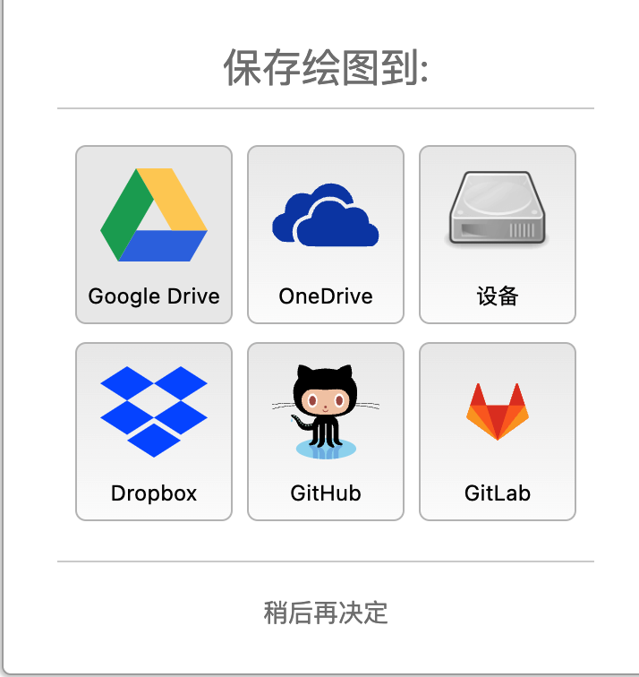
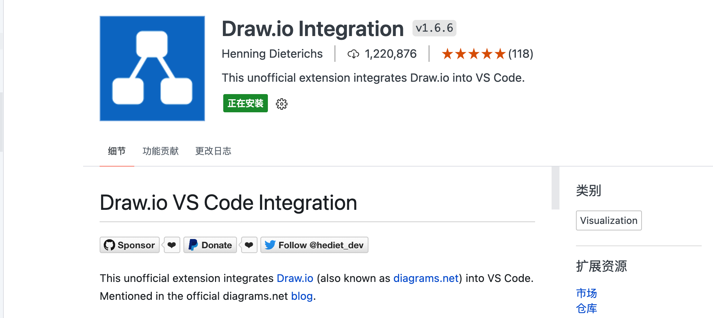
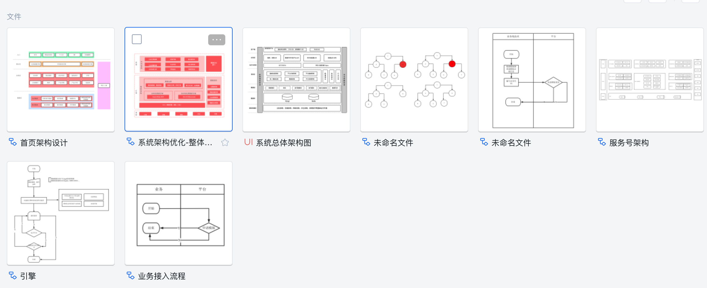
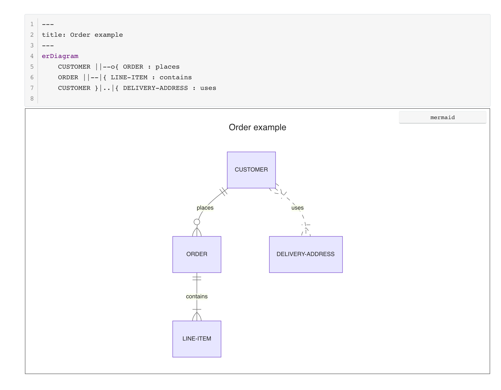

# 画图工具

工作中一直想找个高效率画图工具，现对常用的几款软件做比较。

* [drawio](./draw.md#drawio)
* [processon](./draw.md#processon)
* [mermaid](./draw.md#mermaid)

## drawio

* [网页版本](https://app.diagrams.net/)，支持文件存储到不同位置。

* vscode插件。

* App，以前电脑下载过App，后来卸载掉了。

### 优缺点

很好的作图软件，支持导出img，调整样式不如processOn，后续也在用，但是用的比较少了。

## [processon](https://www.processon.com/diagrams)

网页版画图工具，支持图像自动美化，很好用，需要进行付费。

### 优缺点

自动美化调整样式，缺点免费使用比较少，需要付费。

## mermaid

工作中常用的图该开源软件全部支持，并且支持多种模式。

1. [网页版本。](https://mermaid.live/edit)
2. [支持引擎](https://mermaid.js.org/ecosystem/integrations.html)
   以vscode为案例，安装[Mermaid Preview](https://marketplace.visualstudio.com/items?itemName=vstirbu.vscode-mermaid-preview)，然后既可以支持了。
3. [Typora](https://typoraio.cn/) 软件支持。

### 优缺点

免费、不需要调整样式（自动生成图），像写代码一样修改图，高效。

## 总结

最爱`Typora + mermaid`。
