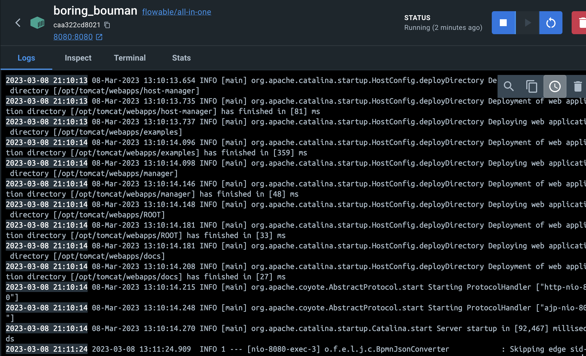
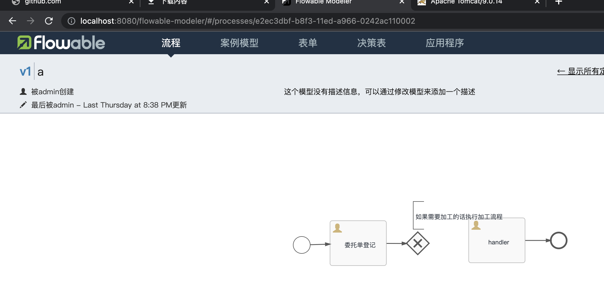
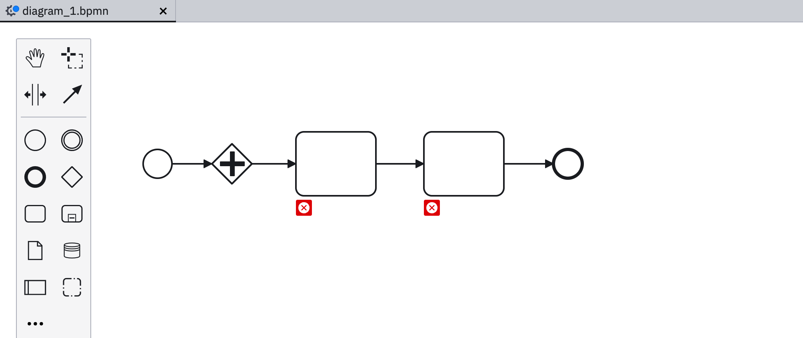
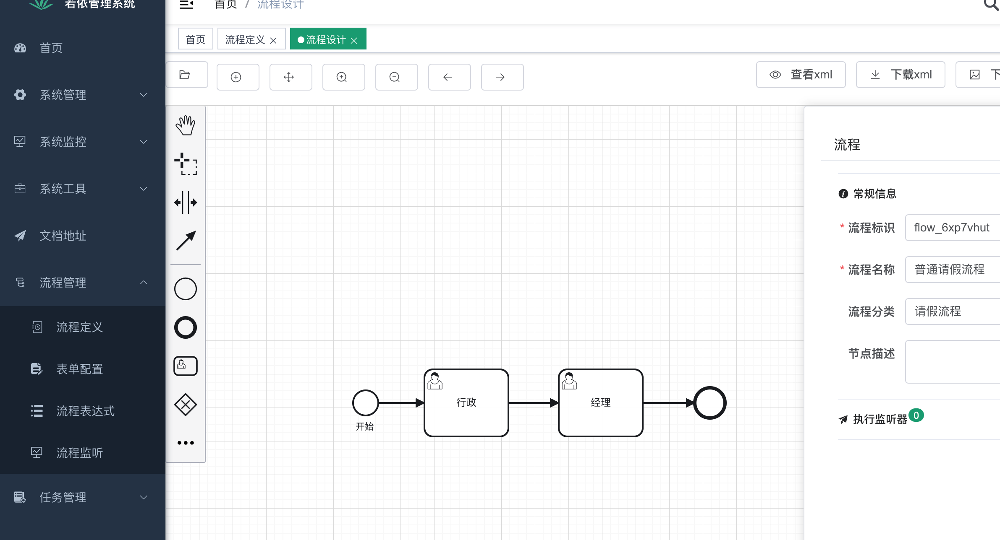

# 工作流设计

工作中工作流设计主要分为两种情况：

1. 编写文档评审使用；
2. 画出bpmn导入程序使用。

## 文档使用

推荐使用`Typora + mermaid`进行编写，编写比较快，无需使用外部应用。

## 编写bpmn文件

编写`bpmn`使用`docker/Camunda`要解决的问题是流程固定，流程启动时自动部署，可以修改的工作流`bpmn xml`放到源码下，不需要前端引入`bpmn`前端插件。

### docker

1. `dockhub`上找到[flowable/all-in-one](https://hub.docker.com/r/flowable/all-in-one)

```bash
docker pull flowable/all-in-one
```

2. 启动docker

```bash
docker run flowable/all-in-one
```

启动后docker显示如所示



3. 查看网站进行编写`bpmn`



### Camunda

下载[Camunda download](https://camunda.com/download/modeler/)，打开软件就能设计出工作流，支持`bpmn`下载。



### 开源项目

在`github`上找到了一个[开源框架 tony2y RuoYi-flowable](https://github.com/tony2y/RuoYi-flowable)，已经编写了工作流前端和后端代码，可以直接设计。


