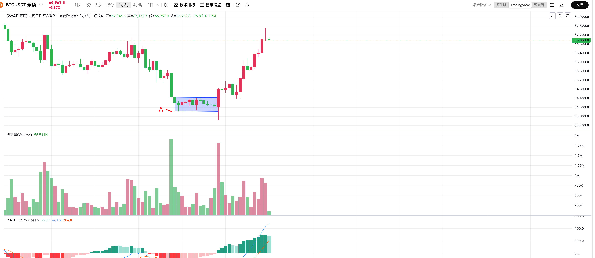

# 交易

1. 时间维度大于价格维度
2. 山寨先跌，bnb,eth,sol在跌，资金全部虹吸大饼

## 交易纪律

1. 高位不做多，低位不做空
2. 交易设置止损，如果打了止损，短期内不要开单，等趋势走出来，再说
   1. 单子逆了趋势，会有更好的价格给你开单
   2. 假突破在回来，还可以在上沿开单

## 常见亏钱小技巧

* 严重踏空心理

  
    如图中这个单子，已经经历过一次大跌，这个时候很多人会有严重踏空心理，底部突破时追空。在下沿开空和上沿开多是盈亏比最差的交易。
    正确做法就是在这里耐心等待，等待一个合适的位置进行开单，比如反弹到65100，如果还被打了止损，执行交易纪律第二条。

* 想赚更多

  打到一个位置的时候，脑子只会想着赚更多，不出来观望

## 常见心理

1. 扛单，但是价格一直拉就会恐惧

## 资金管理

* 仓位不要太重

  在交易的时候一定要控制仓位，仓位太重就容易变形
