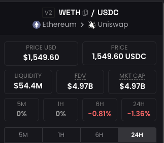

# 流动性获取

* [白皮书](https://uniswap.org/whitepaper.pdf)
* [sdk](https://github.com/Uniswap/v2-sdk/tree/main)
* [weth/usdc](https://dexscreener.com/ethereum/0xb4e16d0168e52d35cacd2c6185b44281ec28c9dc)
  * usdc = 0xA0b86991c6218b36c1d19D4a2e9Eb0cE3606eB48
  * weth = 0xC02aaA39b223FE8D0A0e5C4F27eAD9083C756Cc2

## linea

`linea`使用`pancakeswap`合约置换`eth -> usdc`，3u eth置换出 0.1的代币，尴尬，当时就在想池子流动性太差了，然后就想如何拿到流动性，进行判断，如何低于某个值就不进行swap。

## abi

uniswap v2 转换成人读的abi，留作备份，后续不在转换。

```ts
[
  'constructor()',
  'event Approval(address indexed owner, address indexed spender, uint256 value)',
  'event Burn(address indexed sender, uint256 amount0, uint256 amount1, address indexed to)',
  'event Mint(address indexed sender, uint256 amount0, uint256 amount1)',
  'event Swap(address indexed sender, uint256 amount0In, uint256 amount1In, uint256 amount0Out, uint256 amount1Out, address indexed to)',
  'event Sync(uint112 reserve0, uint112 reserve1)',
  'event Transfer(address indexed from, address indexed to, uint256 value)',
  'function DOMAIN_SEPARATOR() view returns (bytes32)',
  'function MINIMUM_LIQUIDITY() view returns (uint256)',
  'function PERMIT_TYPEHASH() view returns (bytes32)',
  'function allowance(address, address) view returns (uint256)',
  'function approve(address spender, uint256 value) returns (bool)',
  'function balanceOf(address) view returns (uint256)',
  'function burn(address to) returns (uint256 amount0, uint256 amount1)',
  'function decimals() view returns (uint8)',
  'function factory() view returns (address)',
  'function getReserves() view returns (uint112 _reserve0, uint112 _reserve1, uint32 _blockTimestampLast)',
  'function initialize(address _token0, address _token1)',
  'function kLast() view returns (uint256)',
  'function mint(address to) returns (uint256 liquidity)',
  'function name() view returns (string)',
  'function nonces(address) view returns (uint256)',
  'function permit(address owner, address spender, uint256 value, uint256 deadline, uint8 v, bytes32 r, bytes32 s)',
  'function price0CumulativeLast() view returns (uint256)',
  'function price1CumulativeLast() view returns (uint256)',
  'function skim(address to)',
  'function swap(uint256 amount0Out, uint256 amount1Out, address to, bytes data)',
  'function symbol() view returns (string)',
  'function sync()',
  'function token0() view returns (address)',
  'function token1() view returns (address)',
  'function totalSupply() view returns (uint256)',
  'function transfer(address to, uint256 value) returns (bool)',
  'function transferFrom(address from, address to, uint256 value) returns (bool)'
]
```

## 代码

```ts
import { ethers } from "hardhat";

// rpc
const provider = new ethers.providers.JsonRpcProvider(
  "https://singapore.rpc.blxrbdn.com"
);
const weth = "0xC02aaA39b223FE8D0A0e5C4F27eAD9083C756Cc2";

// 合约abi
const pairAbi = [
  "function getReserves() view returns (uint112 _reserve0, uint112 _reserve1, uint32 _blockTimestampLast)",
  "function kLast() view returns (uint256)",
  "function price0CumulativeLast() view returns (uint256)",
  "function price1CumulativeLast() view returns (uint256)",
  "function token0() view returns (address)",
  "function token1() view returns (address)",
];

// pair地址
const demoPairAddress = "0xB4e16d0168e52d35CaCD2c6185b44281Ec28C9Dc";

async function main() {
  // 创建合同
  const pair = new ethers.Contract(demoPairAddress, pairAbi, provider);
  // 拿到返回值
  const r = await pair.getReserves();
  console.log(r);
  const token0 = await pair.token0();
  const token1 = await pair.token1();
  const liq =
    weth.toLowerCase() == token0.toString().toLowerCase()
      ? ethers.utils.formatEther(r[0])
      : ethers.utils.formatEther(r[1]);

  console.log(liq);
  console.log("token0:" + token0);
  console.log("token1:" + token1);
}

main().catch((error) => {
  console.error(error);
  process.exitCode = 1;
});

```

## 结果

上面代码打印结果如下：

```ts
[
  BigNumber { value: "27206009152714" },
  BigNumber { value: "17556707497074736923308" },
  1697117411,
  _reserve0: BigNumber { value: "27206009152714" },
  _reserve1: BigNumber { value: "17556707497074736923308" },
  _blockTimestampLast: 1697117411
]
17556.707497074736923308
token0:0xA0b86991c6218b36c1d19D4a2e9Eb0cE3606eB48
token1:0xC02aaA39b223FE8D0A0e5C4F27eAD9083C756Cc2
```

符号单位`usdc`= `6 uint8`，`weth`= `18 uint8`，

按照符号进行处理展示:

```ts
[
  BigNumber { value: "27206009_152714" },
  BigNumber { value: "17556_707497074736923308" },
  1697117411,
  _reserve0: BigNumber { value: "27206009152714" },
  _reserve1: BigNumber { value: "17556707497074736923308" },
  _blockTimestampLast: 1697117411
]
```

计算对应 = 54M(17556.0 * 1543 + 27206009.152714) = 54M，结果如图所示:

::: center

:::

## 价格计算

在计算价格的时候，因为符号有位数区别，在看代码时候也是看到了以下计算方法。

```ts
function getPairData(IUniswapV2Pair pair) private view returns (IPairReserves.PairReserves memory) {
  (uint256 reserve0, uint256 reserve1, ) = pair.getReserves();
  console.log("pair:", address(pair));
  console.log("reserve0:",reserve0);
  console.log("reserve1:", reserve1);
  uint256 price;
  bool isWETHZero = false;
  if (pair.token0() == address(WETH)) {
      price = reserve1 * 1e18 / reserve0;
      isWETHZero = true;
  } else {
      price = reserve0 * 1e18 / reserve1;
  }

  return IPairReserves.PairReserves(reserve0, reserve1, price, isWETHZero);
}
```

在这里看到`* 1e18`还挺奇怪，问下Gpt，答案如下：
::: tip Gpt答案
在以太坊和大多数以太坊智能合约中，代币的价格通常以固定的小数位数来表示。这个小数位数通常是18，也就是说，代币的价格以 10^18（1后跟18个零）为单位。这是因为 Ethereum 使用了以 wei 为单位的最小货币单位，而 wei 是以太的最小分割单位，1 ETH 等于 10^18 wei。

当您从 Uniswap 池子中获取储备数据时，这些数据也是以 wei 为单位的整数，因此，为了将其转换为代币的价格（通常以 ETH 为基准），您需要将其除以 10^18。

例如，如果 reserve0 和 reserve1 分别表示 Uniswap 池子中两种代币的储备数量，它们是以 wei 为单位的整数。为了计算代币0的价格，您需要执行以下操作：

代币0价格 = (uint256(reserve1) *1e18) / uint256(reserve0);
这个公式将 wei 转换为 ETH 单位的价格。所以，* 1e18 操作是将 wei 转换为 ETH 单位，以便正确表示代币的价格。

注意：如果您的代币价格的小数位数不是18，您需要相应地调整除以的数值，以匹配您代币价格的小数位数。
:::

其实在正常情况下直接使用`代币/eth`即可算出算出一个代币的价格，由于精度不一样，补齐计算，加入以下代码，进行打印。

```ts
const price =
    weth.toLowerCase() == token0.toString().toLowerCase()
      ? (r[1] * 1e12) / r[0]
      : (r[0] * 1e12) / r[1];
console.log("chain price:" + price);
```

打印结果如下：

```ts
chain price:1527.340343787259
```

加入api查询价格代码，代码出自[北北钱包](https://github.com/wxtsky/MyWalletScan/blob/main/src/utils/ether/getEthPrice.js)。

```ts
import axios from "axios";

const getEthPrice = async () => {
    try {
        const ethResponse = await axios.post('https://mainnet.era.zksync.io/', {
            id: 42,
            jsonrpc: '2.0',
            method: 'zks_getTokenPrice',
            params: ['0x0000000000000000000000000000000000000000'],
        });
        return ethResponse.data.result
    } catch (e) {
        console.log(e)
        return 0
    }
}

export default getEthPrice
```

打印结果如下：

```ts
[
  BigNumber { value: "27010665689573" },
  BigNumber { value: "17684771962872525054468" },
  1697132063,
  _reserve0: BigNumber { value: "27010665689573" },
  _reserve1: BigNumber { value: "17684771962872525054468" },
  _blockTimestampLast: 1697132063
]
17684.771962872525054468
chain price:1527.340343787259
fetch price:1631.05
token0:0xA0b86991c6218b36c1d19D4a2e9Eb0cE3606eB48
token1:0xC02aaA39b223FE8D0A0e5C4F27eAD9083C756Cc2
```
