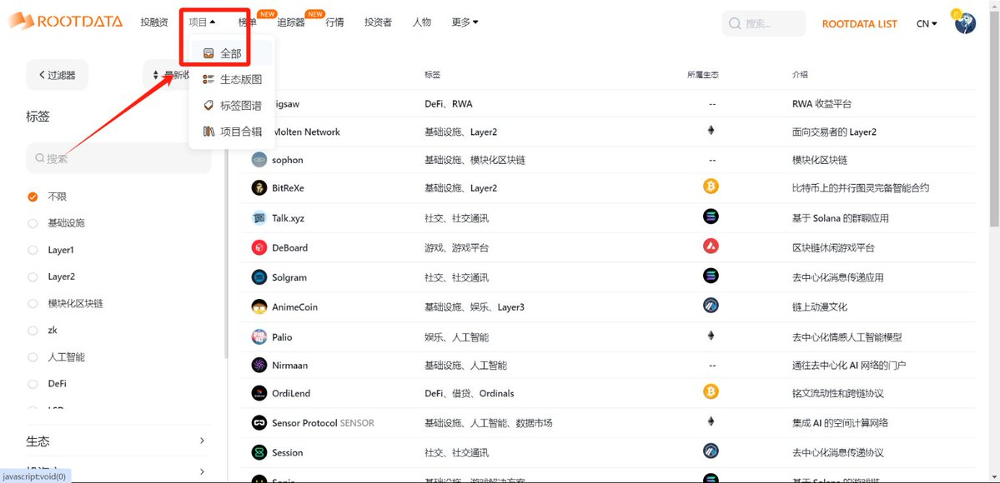
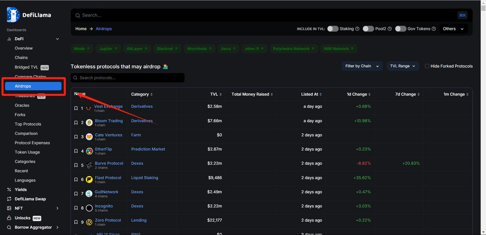
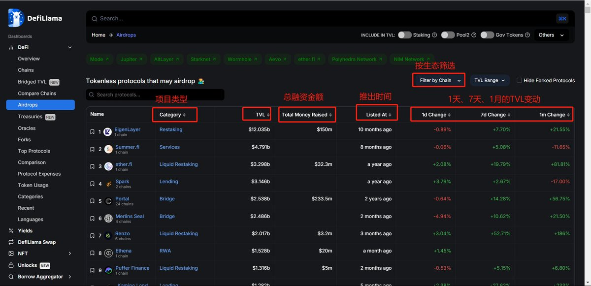
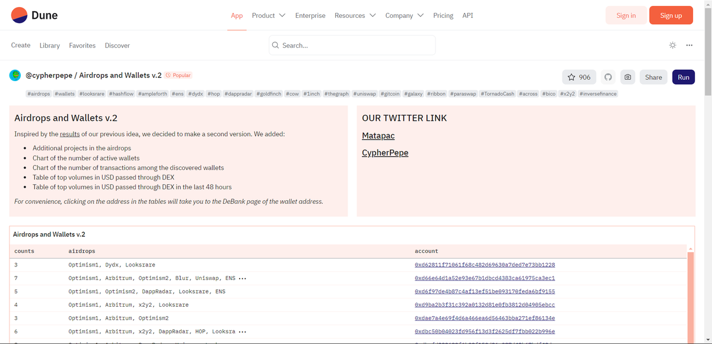
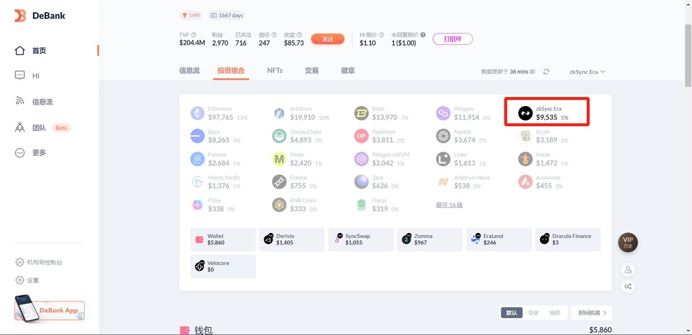
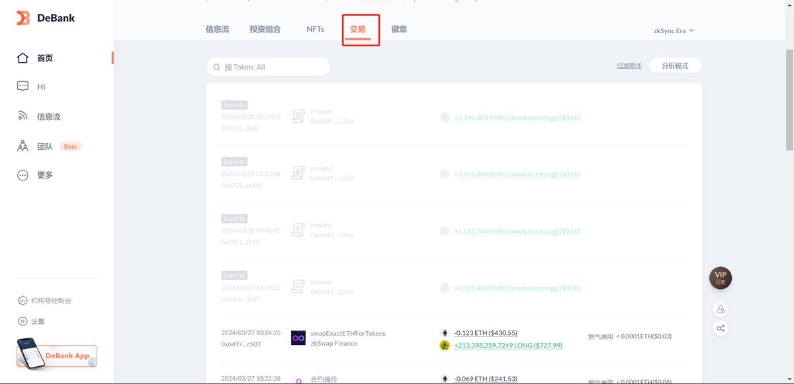
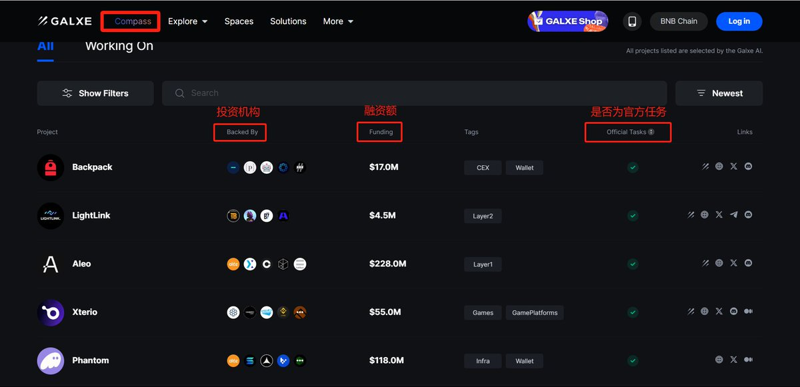
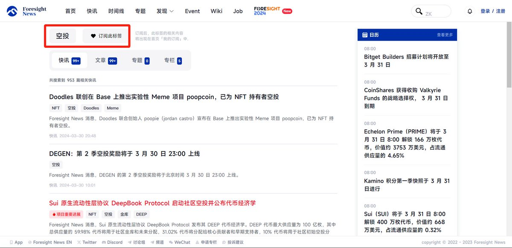
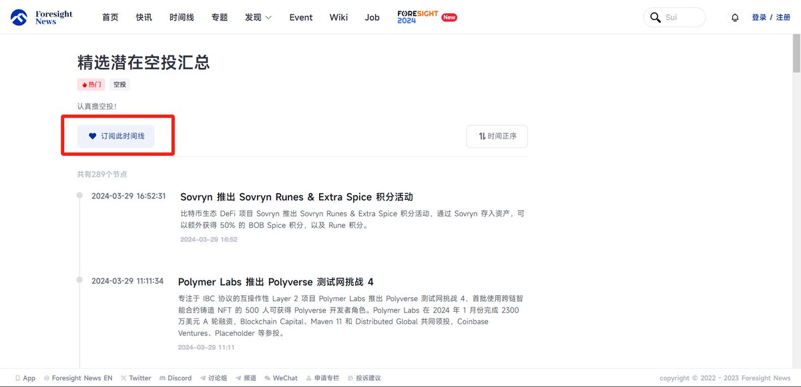

# [毕生所学：如何寻找空投机会？](https://twitter.com/changwenkafei/status/1774327487973236909)

如果你还只会在推特寻找空投项目的话，这篇文章你一定要看看。只看推特推荐，你能撸到大毛几乎就是纯运气了，推特的推荐内容肉眼可见的大部分都是广子和拉人头项目。


靠推特推送这种被动获取信息的形式，很容易陷入信息茧房，从而错失机会。离开舒适圈，主动去寻找空投机会，这是成为一个优秀撸毛人的必修课。

只要将我下边介绍的方法学会，别的不敢说，在空投信息上你将至少超过 90% 的人，成为一个撸毛博主也是简简单单。

📚内容概要

1. 如何使用 Rootdata 筛选项目？
2. 如何使用 Defillama 发现未发币 DeFi 项目？
3. 如何使用 Debank 跟踪空投猎人的交互项目并学习他们的交互策略？
4. 如何使用 Galxe Compass 寻找优质空投项目？
5. 如何使用 Forsightnews 获取最新空投资讯？
6. 一些优质的空投信息网站分享
7. 如何更好的打造自己的推特信息源
8. 社区

这 8 种方法，每种都可以单独出一篇文章，但是为了让大家看的更方便，我还是放在一起发了，希望大家能点赞转发，新人博主真的很需要你们的支持

## 如何使用 Rootdata 筛选项目？

一、如何使用 Rootdata 筛选项目？

Rootdata 是我们常用的查融资工具，但是他在发掘未发币项目上也是十分好用。网站链接：<https://rootdata.com/zh>

使用教程：

1. 我们打开 Rootdata 的项目板块，选择全部。
2. 然后使用左边的过滤器，在 Token 状态中，选择未发行，这样就可以看到 Rootdata 收纳的所有未发币项目了。
3. 使用过滤器的其他筛选项，比如我可以在投资方里面选择币安，这样就可以看到币安投资的未发币项目了。又或者你关注 Solana 生态，想寻找 Solana 生态中的空投机会，在生态中选择 Solana 就可以了。是不是看到很多博主发过这种内容，学会这个方法，你也可以成为博主。




4. 当然你也可以使用投融资板块发现最新的融资信息。例如，图中我就筛选出了币安最新的种子轮投资项目。
5. 如果你有比较信任的 VC，也可以查看他们投资的未发币项目。同样的，如果你有感兴趣的生态，也可以在项目→生态版图中查找未发币项目。
6. 如果找到潜力项目，可以点击收藏进合集里，跟进项目更加方便，也可以顺便撸一下 Rootdata 的积分。如果不想整理，也可以在项目→项目合辑里面查看其他人整理的项目。

### 如何使用 Defillama 发现未发币 DeFi 项目？

Defillama 是一个免费的链上数据工具，相信大家对他并不陌生，非常实用的链上工具，今天我们主要看看他的空投查找功能。
网站链接：<https://defillama.com>

使用教程：

1. 在左侧选择 Airdrops，进入到未发币的 DeFi 项目界面。
2. 我们可以在这个页面通过项目类型、TVL、总融资金额、推出时间、TVL变动、生态等等，对项目进行筛选。
同时在该页面的顶端也可以进入到可查询空投的网站。





### 如何使用 Debank 跟踪空投猎人的交互项目并学习他们的交互策略？

总有一些优秀的撸毛人能撸到大部分大毛，我们将其称为空投猎人（Airdrop Hunter）。他们交互的项目和交互的策略无疑很有参考价值，如果能跟踪他们的地址将会给我们带来很大帮助。跟踪空投猎人与跟踪聪明钱的逻辑相似，都是照葫芦画瓢。
在跟踪空投猎人时，我经常使用的工具是 Debank，Zerion 也可以，我这里以 Debank 为例。
网站链接：<https://debank.com>

使用教程：

1. 发现空投猎人地址,这是我收集的一些空投猎手的地址：

```sh
0x11B1785D9Ac81480c03210e89F1508c8c115888E
0x1254df8581b92609f087a505f77b4a9dc89502c3
0x1a616dae57382a9084c026d3f475aed59c2668cb
0xb26d9424f0f435c8b10ed478af36da8ca7d5b095
0xb2801900fb83990284f394ae48182602c3c7fc51
0xf9107317b0ff77ed5b7adea15e50514a3564002b
```

更多的空投猎手可以在该 Dune 看板寻找：<https://dune.com/cypherpepe/airdrops-and-wallets>


2. 使用 Debank 跟踪,搜索某个空投猎人的地址后，我们可以选择看他交互的某一条链。

往下翻可以看到他在这条链 DeFi 项目的存款，点击交易可以看到他的链上交互记录，也可以进入分析模式查看具体某条链的交互记录（需要付费）。这对于我们借鉴空投猎人的交互项目与策略十分有帮助。


### 如何使用 Galxe Compass 寻找优质空投项目？

估计大家一看到银河就开始头疼了，银河简直是撸毛人的噩梦。什么阿猫阿狗的项目都可以在银河上发布任务，直接在银河找任务做，撸一百个项目也出不了一个大毛。
但是银河的 Compass 还是很好用的，里面都是一些背景不错的热门项目，而且自带交互教程。
网站链接：<https://galxe.com/compass?sort=Newest>



### 如何使用 Foresightnews 获取最新空投资讯？

这部分要感谢
@Yizhimao_super
 提供的教程，非常优秀的空投博主，大家可以给他点点关注。

使用教程：

1. 订阅“空投”标签，查看空投相关的内容更加方便。
链接：<https://foresightnews.pro/tag?tagId=55&tagName=%E7%A9%BA%E6%8A%95>


2. 该栏目主要分享一些潜在的空投信息，覆盖面很广。
链接：<https://foresightnews.pro/timeline/detail/53>


### 一些优质的空投信息网站分享

如果你还不会自己判断项目的好坏或者你懒得去找项目，使用一些专业空投网站或许是不错的选择。
这里一共介绍六个专业的空投信息网站

1. 51 Airdrop
项目有评级、教程，也有一些关于撸毛的科普，部分功能需要付费。
<https://51airdrop.io/dashboard/all-airdrops>

2. Airdrop alert
项目分类做得还可以，就是项目质量参差不齐，需要有一定的判断能力。
<https://airdropalert.com>

3. Alpha Drops
项目质量还可以，找不同板块的项目也很方便。
<https://alphadrops.net/alpha>

4. Airdrops
老牌的空投网站了，项目质量都很高，力推。
<https://airdrops.io>

5. Cryptocreed
排版与其他网站差别挺大，但是我挺喜欢他精简的页面。
<https://cryptocreed.com/airdrop/>

6. DefiCalendar
项目质量高，但更新频率慢.
<https://deficalendar.xyz>

### 如何更好的打造自己的推特信息源？

非常不建议大家只刷推特推荐的内容，非常低效。
最好是将一些你认为优质的博主加入列表中，然后从列表中查看消息，或是在主页时间线中查看你的关注。

挑选原则是什么？

1. 一手消息。
2. 对一手消息的分析和总结比较强。
3. 发现潜力项目或者小众项目的能力较强。
4. 中英文区都要有。

除了从一些博主那里获取信息，项目方及其合作伙伴、VC 也是很好信息源。
将你正在撸的一些项目添加在一个列表中，关于这些项目的消息就不会错过了，重要信息都是处在项目方的公告中，自己跟进项目很重要。而且一个优质的项目，他的亲密合作伙伴质量也不会太差，可以顺藤摸瓜的了解一下合作伙伴的情况。
其次是关注一些 VC，一般都会宣布他们投资项目以及投资的理由之类，还会发布他们看好的赛道，对我们找项目和学习都十分有帮助。如果不知道关注哪些 VC，可以去 Rootdata 根据他们的资金规模和投资过的一些项目进行挑选。

### 社区

这方面我经验比较少，一般都是自己找项目。很多博主都有自己的社区，我没加过所以不好推荐，大家可以把一些优质社区发在评论区。
