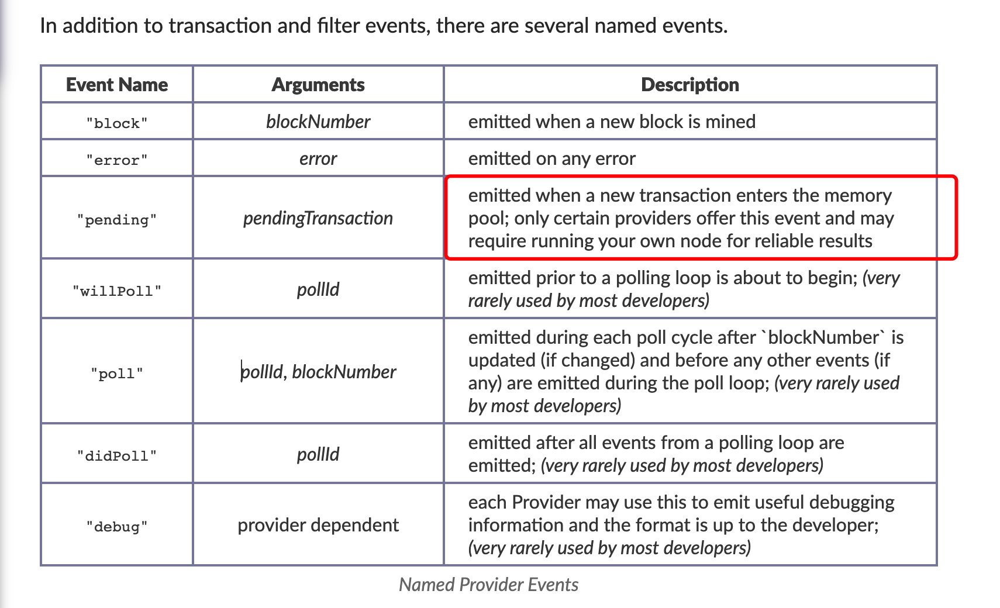

# 套利

[代码地址](https://github.com/rfk1118/simple-blind-arbitrage/tree/main)

## 启动程序

启动程序主要包含三个维度链下代码：

* 监听者
* 池子查询
* 套利绑定代码

## 全局绑定三者关系

这一段也叫上帝代码。

```js
// 解析数据
const data = JSON.parse(event.data);
console.log("New transaction with hash:", data.hash);
// 如果没有数据
if (data.logs == null) {
  return;
}

// Loop through all the logs in the transaction
console.log("Transaction has logs, parsing them");
for (let i = 0; i < data.logs.length; i++) {

  console.log(data.logs[i]);
  // 判断是否是swap主题
  if (data.logs[i].topics[0] != config.syncTopic) {
    continue;
  } // Skip if it isn't a sync event
  // 获取第一个交易池子
  const firstPair = data.logs[i].address; // Get the address of the first pair, which is the address the logs are coming from

  console.log(
    "Transaction trading on Uniswap v2 pool detected! Pool address:",
    firstPair
  );

  // 根据第一个pair判断是否存在池子
  const [token0, token1, factoryToCheck] = await poolManager.checkPool(
    firstPair
  ); // Get the pool and the other factory we need to check
  // 未找到池子
  if (token0 == false || token1 == false || factoryToCheck == false) {
    return;
  } // These are false if the pool does not have a WETH pair

  // 获取到第二个池子
  const secondPair = await poolManager.checkFactory(
    factoryToCheck,
    token0,
    token1
  ); // Check if the other factory has the pool too
  // 没有套利的池子
  if (secondPair == false) {
    return;
  } // If it doesn't, stop here

  // 进行套利
  await bundleExecutor.execute(firstPair, secondPair, data.hash); // Execute the bundle if we've made it this far
```

## 监听者

主要为`MevShareNode`，这里也就是观察者设计模式，需要注意的是需要监听池子`pending数据`，核心代码如下，创建观察者，


```js
    MevShareNode = new EventSource(config.mainnetMevShareNode)
    // 有事件发生
    MevShareNode.onmessage = async (event) => {

        }
    };
    MevShareNode.onerror = (error) => {
        // Handle the error
        console.error(error);
    }
```

## 池子查询

这里主要用的uniswap和Sushi进行套利。

```js

class PoolManager {
    constructor(_provider, _network) {
        this.provider = _provider
        // 根据网络拿不同的地址
        if (_network == 'mainnet') {
            this.UniswapFactoryAddress = config.mainnetUniswapFactoryAddress
            this.SushiFactoryAddress = config.mainnetSushiFactoryAddress
            this.WETHAddress = config.mainnetWETHAddress
        } else if (_network == 'goerli') {
            this.UniswapFactoryAddress = config.goerliUniswapFactoryAddress
            this.SushiFactoryAddress = config.goerliSushiFactoryAddress
            this.WETHAddress = config.goerliWETHAddress
        }

        console.log("PoolManager initialized for network:", _network)
    }

    async checkPool(_address) {
        // Create an ethers contract object for the pool
        // 根据池子地址链接到合约
        const poolContract = new ethers.Contract(_address, poolABI, this.provider)
        console.log("Pool contract created, getting tokens")
        // 拿到两个代币的数量
        const token0 = await poolContract.token0()
        const token1 = await poolContract.token1()
        console.log("Token0:", token0)
        console.log("Token1:", token1)

        // 找到属于那个swap
        const factory = await poolContract.factory()
        console.log("Factory:", factory)
        // 不是eth为本位的跳过
        if (token0 == this.WETHAddress || token1 == this.WETHAddress) {
            // 这里的返回很有意思，因为后续需要另外一个工厂查找池子
            console.log("Pool is WETH pair")
            // 如果为uniswap的话返回sui
            if (factory == this.UniswapFactoryAddress) {
                console.log("Pool is Uniswap v2")
                return [token0, token1, this.SushiFactoryAddress]
            } else {
                // 如果为sui的话返回uniswap
                console.log("Pool is Sushiswap")
                return [token0, token1, this.UniswapFactoryAddress]
            }
        } else {
            console.log("Pool is not WETH pair, WETH address is:", this.WETHAddress)
            return [false, false, false]
        }
    }

    async checkFactory (_factoryAddress, _token0, _token1) {
        // Create an ethers contract object for the factory
        // 创建工厂
        const factoryContract = new ethers.Contract(_factoryAddress, factoryABI, this.provider)
        console.log("Checking alternative factor for pair")
        // 根据代币对查找池子

        const pair = await factoryContract.getPair(_token0, _token1)
        // 未找到池子
        if (pair == "0x0000000000000000000000000000000000000000"){
            console.log("Pair does not exist on alternative factory, returning")
            return false
        } else {
           // 返回池子
            console.log("Alternate pair exists! Pair address:", pair)
            return pair
        }
    }
}

module.exports = PoolManager
```

## 套利绑定代码

主要查看buildBundles方法

```js

class BundleExecutor {
    constructor(_signer, _flashbotsBundleProvider, _contractAddress, _bundleAPI, _percentageToKeep) {
        // 钱包
        this.signer = _signer
        // flashbot Rpc
        this.flashBotsBundleProvider = _flashbotsBundleProvider
        // 套利的合约代码
        this.contract = new ethers.Contract(_contractAddress, blindBackrunJSON, this.signer)
        this.connectionInfo = {
            url: _bundleAPI,
        }
        this.nextID = 1
        // 给矿工的钱
        this.percentageToKeep = _percentageToKeep

        console.log('Successfully created BundleExecutor')
    }

    /**
     * Executes arbitrage by sending bundles to the MEV-Share Node for a given transaction hash.
     * @param {string} _firstPair - The first pair's address.
     * @param {string} _secondPair - The second pair's address.
     * @param {string} _txHash - The transaction hash to execute the bundles on.
     */
    async execute(_firstPair, _secondPair, _txHash) {
        console.log("Sending bundles to MEV-Share Node for tx:", _txHash)
        // 创建tx
        const [bundleOneWithParams, bundleTwoWithParams] = await this.buildBundles(_firstPair, _secondPair, _txHash)
        // 获取结果
        await this.sendBundleToNode(bundleOneWithParams, bundleTwoWithParams)
    }

    /**
     * Sends bundles to the MEV-Share Node.
     * @param {Object} _bundleOneWithParams - The first bundle with parameters.
     * @param {Object} _bundleTwoWithParams - The second bundle with parameters.
     */
    async sendBundleToNode(_bundleOneWithParams, _bundleTwoWithParams) {
        await Promise.all([
            this.sendBundle(_bundleOneWithParams),
            this.sendBundle(_bundleTwoWithParams)
        ])
    }

    // At the moment this function isn't used at all because the MEV-Share Node doesn't support simulation against searcher bundles yet.
    async simBundle(_bundle) {
        const request = JSON.stringify(this.prepareRelayRequest([_bundle], 'mev_simBundle'))
        const response = await this.request(request)
        return response
    }

    /**
     * Sends a bundle.
     * @param {Object} _bundle - The bundle to sending.
     * @returns {Promise<Object>} The response from sending the bundle.
     */
    async sendBundle(_bundle) {

        const request = JSON.stringify(this.prepareRelayRequest([_bundle], 'mev_sendBundle'))
        const response = await this.request(request)
        console.log("response:", response)
    }

    /**
     * Prepares a relay request with the given method and parameters.
     * @param {Array} _params - The parameters for the relay request.
     * @param {string} _method - The method for the relay request.
     * @returns {Object} The prepared relay request.
     */
    prepareRelayRequest(_params, _method) {
        return {
            method: _method,
            params: _params,
            id: this.nextID++,
            jsonrpc: '2.0'
        }
    }

    /**
     * Sends a request with the specified payload.
     * @param {string} _request - The request payload.
     * @returns {Promise<Object>} The response from the request.
     */
    async request(_request) {
        this.connectionInfo.headers = {
          'X-Flashbots-Signature': `${await this.signer.address}:${await this.signer.signMessage(ethers.utils.id(_request))}`
        }
        console.log("Making request:", _request)
        let resp = await ethers.utils.fetchJson(this.connectionInfo, _request)
        return resp
      }

      /**
     * Builds bundles for the given pair addresses and transaction hash.
     * @dev This function outputs two bundles, one for each potential trade direction. Only one will succeed depending on the direction of the user's trade.
     * @param {string} _firstPair - The first pair's address.
     * @param {string} _secondPair - The second pair's address.
     * @param {string} _txHash - The transaction hash to backrun.
     * @returns {Promise<Array>} An array containing two bundles backrunning the user's _txHash.
     */
    async buildBundles(_firstPair, _secondPair, _txHash) {
        // 获取blockNumber
        let blockNumber = Number(await this.signer.provider.getBlockNumber())
        console.log("Current block number:", blockNumber)
        console.log("Building bundles")

        // 可以填的参数
        let bundleTransactionOptions = {
            // gas价格
            gasPrice: (await this.signer.provider.getGasPrice()), // This is *extremely* naive.
            // 限制
            gasLimit: ethers.BigNumber.from(400000),
            // tx
            nonce: await this.signer.getTransactionCount(),
        }


        // 编译合约参数，主要是第一个池子和第二个池子
        const types = [
            'address',
            'address',
            'uint256'
        ]

        // 参数
        const valuesFirstTrade = [
            _firstPair,
            _secondPair,
            this.percentageToKeep
        ]

        let paramsFirstTrade = Web3EthAbi.encodeParameters(types, valuesFirstTrade)

        // 第一个tx
        let bundleOneTransaction = await this.contract.populateTransaction.makeFlashLoan(
            config.mainnetWETHAddress,
            ethers.BigNumber.from(10**21).toString(),
            paramsFirstTrade,
            bundleTransactionOptions
        )

        let bundleOne = [
            {hash: _txHash},
            {tx: await this.signer.signTransaction(bundleOneTransaction), canRevert: false},
        ]

        const valuesSecondTrade = [
            _secondPair,
            _firstPair,
            this.percentageToKeep
        ]

        let paramsSecondTrade = Web3EthAbi.encodeParameters(types, valuesSecondTrade)

        let bundleTwoTransaction = await this.contract.populateTransaction.makeFlashLoan(
            config.mainnetWETHAddress,
            ethers.BigNumber.from(10**21).toString(),
            paramsSecondTrade,
            bundleTransactionOptions
        )

        let bundleTwo = [
            {hash: _txHash},
            {tx: await this.signer.signTransaction(bundleTwoTransaction), canRevert: false},
        ]

        // 返回第二个tx
        const bundleOneWithParams = this.bundleWithParams(blockNumber + 1, 10, bundleOne)
        const bundleTwoWithParams = this.bundleWithParams(blockNumber + 1, 10, bundleTwo)
        return [bundleOneWithParams, bundleTwoWithParams]
    }

    /**
     * Adds parameters to a bundle for the given block number and blocks to try.
     * @notice The version number might need to change in the future. This is the only one that works at the moment.
     * @param {number} _blockNumber - The block number to submit initially for.
     * @param {number} _blocksToTry - The number of blocks to try.
     * @param {Array} _bundle - The bundle to add parameters to.
     * @returns {Object} The bundle with parameters.
     */
    bundleWithParams(_blockNumber, _blocksToTry, _bundle) {
        console.log("Submitting bundles for block:", _blockNumber, "through block:", _blockNumber + _blocksToTry)
        console.log("hexvalue    :", ethers.utils.hexValue(_blockNumber))
        console.log("Other method:", "0x" + _blockNumber.toString(16))

        return {
            version:"beta-1", //@NOTICE: This is the only version that works at the moment.
            inclusion: {
                block: ethers.utils.hexValue(_blockNumber),
                maxBlock: ethers.utils.hexValue(_blockNumber + _blocksToTry)
            },
            body: _bundle,
        }
    }
}
module.exports = BundleExecutor
```

## 合约代码

```ts
contract BlindBackrun is BlindBackrunLogic {
    constructor(IWETH _wethAddress) BlindBackrunLogic(_wethAddress) {}


    // 执行套利
    function executeArbitrage(
        address firstPairAddress,
        address secondPairAddress,
        uint percentageToPayToCoinbase
    ) external onlyOwner {
        // 执行套利
        _executeArbitrage(firstPairAddress, secondPairAddress, percentageToPayToCoinbase);
    }


    function withdrawWETHToOwner() external onlyOwner {
        uint256 balance = WETH.balanceOf(address(this));
        WETH.transfer(msg.sender, balance);
    }
    function withdrawETHToOwner() external onlyOwner {
        uint256 balance = address(this).balance;
        payable(msg.sender).transfer(balance);
    }
}

abstract contract BlindBackrunLogic is Ownable {
    uint256 constant uniswappyFee = 997;

    // 构建的时候设置weth地址
    IWETH public immutable WETH;

    constructor(IWETH _wethAddress) {
        WETH = _wethAddress;
    }
    function _executeArbitrage(
        address firstPairAddress,
        address secondPairAddress,
        uint percentageToPayToCoinbase
    ) internal {
        // 记录当前余额
        uint256 balanceBefore = WETH.balanceOf(address(this));
        console.log("Starting balance  : %s", balanceBefore);
        // 根据池子获取代币信息
        IUniswapV2Pair firstPair = IUniswapV2Pair(firstPairAddress);
        IUniswapV2Pair secondPair = IUniswapV2Pair(secondPairAddress);

        console.log("\n--------- PAIR DATA ---------");
        // 转换成结构体
        IPairReserves.PairReserves memory firstPairData = getPairData(firstPair);
        IPairReserves.PairReserves memory secondPairData = getPairData(secondPair);

        console.log("\n--------- PRICES ---------");
        console.log("firstPair price   : %s", firstPairData.price);
        console.log("secondPair price  : %s", secondPairData.price);
        // 获取需要借贷多少
        uint256 amountIn = getAmountIn(firstPairData, secondPairData);
            console.log("\n--------- TRADE AMOUNTS ---------");
            console.log("amountIn          : %s", amountIn);

        // 传输给第一个池子
        WETH.transfer(firstPairAddress, amountIn);

        uint256 firstPairAmountOut;
        uint256 finalAmountOut;
        if (firstPairData.isWETHZero == true){
            // 计算出可以换出多少
            firstPairAmountOut = getAmountOut(amountIn, firstPairData.reserve0, firstPairData.reserve1);
            // 计算出第二个池子可以换出多少
            finalAmountOut = getAmountOut(firstPairAmountOut, secondPairData.reserve1, secondPairData.reserve0);

            console.log("firstPairAmountOut: %s", firstPairAmountOut);
            console.log("finalAmountOut    : %s", finalAmountOut);
            console.log("arb profit        : %s", finalAmountOut - amountIn);

            console.log("\n--------- TRADING ---------");
            // 置换成代币
            firstPair.swap(0, firstPairAmountOut, secondPairAddress, "");
            console.log("firstPair swap done");
            // 置换成weth
            secondPair.swap(finalAmountOut, 0, address(this), "");
            console.log("secondPair swap done");
        } else {
            firstPairAmountOut = getAmountOut(amountIn, firstPairData.reserve1, firstPairData.reserve0);
            finalAmountOut = getAmountOut(firstPairAmountOut, secondPairData.reserve0, secondPairData.reserve1);
            console.log("\n--------- TRADE AMOUNTS ---------");
            console.log("amountIn          : %s", amountIn);
            console.log("firstPairAmountOut: %s", firstPairAmountOut);
            console.log("finalAmountOut    : %s", finalAmountOut);
            console.log("arb profit        : %s", finalAmountOut - amountIn);

            console.log("\n--------- TRADING ---------");

            firstPair.swap(firstPairAmountOut, 0, secondPairAddress, "");
            console.log("firstPair swap done");

            secondPair.swap(0, finalAmountOut, address(this), "");
            console.log("secondPair swap done");
        }
        // 查看余额
        uint256 balanceAfter = WETH.balanceOf(address(this));
        require(balanceAfter > balanceBefore, "Arbitrage failed");
        console.log("\n--------- SUCCESS ---------");
        console.log("Ending balance    : %s", balanceAfter);
        // 给矿工比例
        uint profit = balanceAfter - balanceBefore;
        console.log("Profit            : %s", profit);
        // 提款
        WETH.withdraw(profit);
        uint profitToCoinbase = profit * percentageToPayToCoinbase / 100;
        uint profitToCaller = profit - profitToCoinbase;
        // 给矿工的钱
        block.coinbase.transfer(profitToCoinbase);
        payable(tx.origin).transfer(profitToCaller);
    }

    // 根据两个池子算出要借多少钱
    function getAmountIn(
        IPairReserves.PairReserves memory firstPairData,
        IPairReserves.PairReserves memory secondPairData
    ) public view returns (uint256) {
        // 算法，需要进一步研究
        uint256 numerator = getNumerator(firstPairData, secondPairData);
        console.log("numerator: %s", numerator);
        uint256 denominator = getDenominator(firstPairData, secondPairData);
        console.log("denominator: %s", denominator);
        uint256 amountIn =
            numerator
            * 1000
            / denominator;

        return amountIn;
    }

    // 算法，需要进一步研究
    function getNumerator(
        IPairReserves.PairReserves memory firstPairData,
        IPairReserves.PairReserves memory secondPairData
    ) public view returns (uint256) {
        if (firstPairData.isWETHZero == true) {
            uint presqrt = uniswappyFee
                    * uniswappyFee
                    * firstPairData.reserve1
                    * secondPairData.reserve0
                    / secondPairData.reserve1
                    / firstPairData.reserve0;
            console.log("presqrt: %s", presqrt);
            console.log("sqrt(presqrt): %s", sqrt(presqrt));
            uint256 numerator =
            (
                sqrt(presqrt)
                - 1e3
            )
            * secondPairData.reserve1
            * firstPairData.reserve0;

            return numerator;
        } else {
            uint presqrt = uniswappyFee
                * uniswappyFee
                * firstPairData.reserve0
                * secondPairData.reserve1
                / secondPairData.reserve0
                / firstPairData.reserve1;


            uint256 numerator =
            (
                sqrt(presqrt)
                - 1e3
            )
            * secondPairData.reserve0
            * firstPairData.reserve1;

            return numerator;
        }
    }

    // 算法，需要进一步研究
    function getDenominator(
            IPairReserves.PairReserves memory firstPairData,
            IPairReserves.PairReserves memory secondPairData
        ) public pure returns (uint256){
        if (firstPairData.isWETHZero == true) {
            uint256 denominator =
                (
                    uniswappyFee
                    * secondPairData.reserve1
                    * 1000
                )
                + (
                    uniswappyFee
                    * uniswappyFee
                    * firstPairData.reserve1
                );
            return denominator;
        } else {
            uint256 denominator =
                (
                    uniswappyFee
                    * secondPairData.reserve0
                    * 1000
                )
                + (
                    uniswappyFee
                    * uniswappyFee
                    * firstPairData.reserve0
                );
            return denominator;
        }
    }

    // 根据池子信息进行转换
    function getPairData(IUniswapV2Pair pair) private view returns (IPairReserves.PairReserves memory) {
        (uint256 reserve0, uint256 reserve1, ) = pair.getReserves();
        console.log("pair:", address(pair));
        console.log("reserve0:",reserve0);
        console.log("reserve1:", reserve1);

        uint256 price;

        bool isWETHZero = false;
        if (pair.token0() == address(WETH)) {
            price = reserve1 * 1e18 / reserve0;
            isWETHZero = true;
        } else {
            price = reserve0 * 1e18 / reserve1;
        }

        return IPairReserves.PairReserves(reserve0, reserve1, price, isWETHZero);
    }

    // 功能方法
    function sqrt(uint256 x) private pure returns (uint256) {
        if (x == 0) return 0;
        uint256 z = (x + 1) / 2;
        uint256 y = x;
        while (z < y) {
            y = z;
            z = ((x / z) + z) / 2;
        }
        return y;
    }


    function getAmountOut(uint amountIn,
        uint reserveIn,
        uint reserveOut
    ) internal pure returns (uint amountOut) {
        uint amountInWithFee = amountIn * 997;
        uint numerator = amountInWithFee * reserveOut;
        uint denominator = reserveIn * 1000 + amountInWithFee;
        amountOut = numerator / denominator;
        return amountOut;
    }
    // 传输代币
    function call(address payable _to, uint256 _value, bytes memory _data) external onlyOwner {
        (bool success, ) = _to.call{value: _value}(_data);
        require(success, "External call failed");
    }


    receive() external payable {}
}

```

## 总结

1. 三角套利？eth - A - B - eth
2. uniswap v2 - v3 ? v3- v3?
3. 如何提高调用正确率，即成功后可以覆盖`gas`部分
