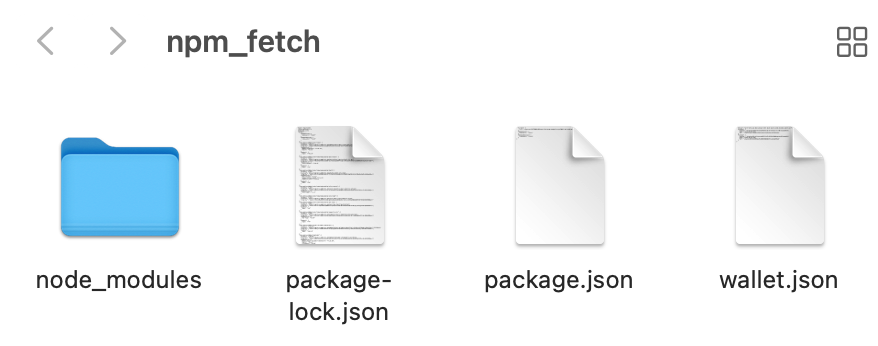
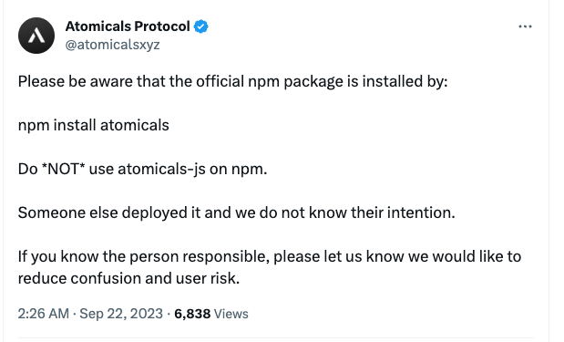
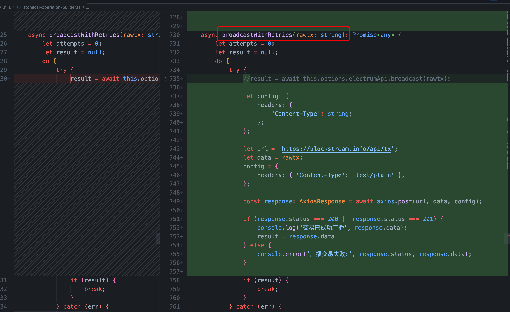

# atomical

* [推特](https://twitter.com/atomicalsxyz)
* [Github](https://github.com/atomicals)
* [npm](https://www.npmjs.com/package/atomical)

关于arc20叙事不在叙述，本文章主要是为了做测试和完善一些流程。

## 安装

1. 创建文件夹`npm_fetch`



2. 创建`package.json`，输入内容:

```json
{
  // 运行的cli脚本
  "scripts": {
    "cli": "cross-env ELECTRUMX_WSS=wss://electrumx.atomicals.xyz:50012 node node_modules/atomicals/dist/cli.js"
  },
  // cli包
  "dependencies": {
    "atomicals": "latest"
  },
  "devDependencies": {
    "cross-env": "^7.0.3"
  }
}
```

这里为什么要使用`atomicals`，其实整个圈就是个黑暗森林，有了官方包，就会有钓鱼包，所以一切以官方和下载量为准，或者自行审计代码。



## 执行

1. 进行安装，执行`npm i`，会安装依赖，生成`node_modules`和`package-lock`的json文件。
2. 进行钱包初始化，使用`npm run cli wallet-init`，生成文件`wallet.json`，并输出

```sh
> cli
> cross-env ELECTRUMX_WSS=wss://electrumx.atomicals.xyz:50012 node node_modules/atomicals/dist/cli.js wallet-init

Wallet created at wallet.json
phrase: speed wish funny job case honey exhibit ozone pledge soft sentence sign
Primary address (P2TR): bc1pde8qfdp75yxwmp6hkl4t6kuqska2ac3pu6kl4z2htunflm6zc53smnaf84
Primary address WIF: KxHHNDUcBma4ymK2yu2MwzumBRQhb2WwDwYcaBBWXuvvP22bCogu
Primary address path: m/44'/0'/0'/0/0
Funding address (P2TR): bc1phrh5yckajcx4kjstyk595puenntsz24rzf7qaussu9p76rm20vzqknk3hx
Funding address WIF: L2e216oagUXtVSCTS3cEb5n2nX2edjuW7zit369Fj6jvTFugrkPW
Funding address path: m/44'/0'/0'/1/0
------------------------------------------------------


{
  // 助记词
  "phrase": "speed wish funny job case honey exhibit ozone pledge soft sentence sign",
  "primary": {
    // 存款地址
    "address": "bc1pde8qfdp75yxwmp6hkl4t6kuqska2ac3pu6kl4z2htunflm6zc53smnaf84",
    "path": "m/44'/0'/0'/0/0",
    // 私钥
    "WIF": "KxHHNDUcBma4ymK2yu2MwzumBRQhb2WwDwYcaBBWXuvvP22bCogu"
  },
  "funding": {
    "address": "bc1phrh5yckajcx4kjstyk595puenntsz24rzf7qaussu9p76rm20vzqknk3hx",
    "path": "m/44'/0'/0'/1/0",
    "WIF": "L2e216oagUXtVSCTS3cEb5n2nX2edjuW7zit369Fj6jvTFugrkPW"
  }
}
```

3. 进行其他地址进行转账后，就可以打铭文了，执行命令`npm run cli mint-dft pepe`。

```sh

> cli
> cross-env ELECTRUMX_WSS=wss://electrumx.atomicals.xyz:50012 node node_modules/atomicals/dist/cli.js mint-dft pepe

Args { mint_ticker: 'pepe' }
Meta undefined
Ctx undefined
====================================================================
Mint Interactive FT (Decentralized)
====================================================================
Atomical type: FUNGIBLE (decentralized) [
  {
    name: 'args',
    contentType: 'object',
    data: { mint_ticker: 'pepe' }
  }
] pepe
Mint for ticker:  pepe
{
  coin: 'Bitcoin',
  network: 'mainnet',
  height: 809172,
  block_tip: '00000000000000000003530198552e0bce3ca2e23f40d0040ec1e84c5da596d0',
  server_time: '2023-09-24T16:14:31.764855',
  atomicals_block_tip: '42fc0d35eeb1c943510fa71c6126d8afa2fd757d49d7f4a708938b8497a33c97',
  atomical_count: 5017
} {
  // 其他省略
```

4. 查询余额，在钱包下会输出

```sh
Atomical number: 791
Atomical type: FT
Atomical subtype: decentralized
Requested ticker: pepe
Requested ticker status: verified
Ticker: pepe
Confirmed balance: 56000
UTXOs for Atomical: 28
```

## 广播出错

在算力算出结果进行广播的时候会经常网络重试，主要是RPC节点被打满了，当天晚上`comeon`大佬对代码进行了改造。

```js
let url = 'https://blockstream.info/api/tx';
let data = rawtx;
config = {
    headers: { 'Content-Type': 'text/plain' },
};

const response: AxiosResponse = await axios.post(url, data, config);

if (response.status === 200 || response.status === 201) {
    console.log('交易已成功广播', response.data);
    result = response.data
} else {
    console.error('广播交易失败:', response.status, response.data);
}
```

修改广播`broadcastWithRetries`，效率提高不少。



## 安全

在运行时审计代码太过耗时，可能会错过行情，一般大家喜欢上云处理，但是上云要解决梯子和安全问题，但是在本地又不放心，这时候使用`Docker`就是最优选择，因为宿主机器不能拿到外部机器资源。
有老哥在[Github](https://github.com/lucky2077/atomicals-image)上面给了`Dockerfile`项目，这里就不在改造了。

## 总结

* 一定在关键时期换节点，不要使用公用节点
* 对于算数算的比较久的话，一定要修改源码中的重试次数
* 关于utxo一次打完问题，有人在`icals`上100刀打了一张问题，需要对utxo基础知识深入理解，如何使用utxo解决双花
* 关于`cpfp加速`和`RBF`加速问题
* 惯性思维，在处理自动化的时候误入脚本思维定式，没有第一时间想着改源码
