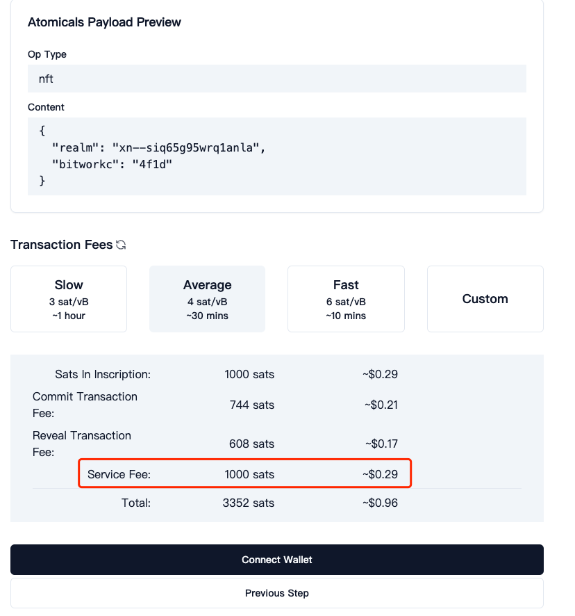
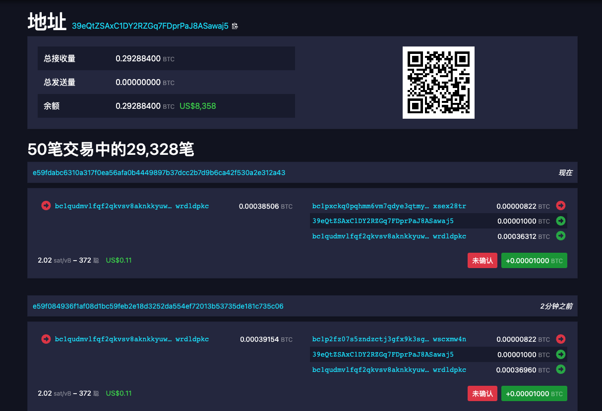
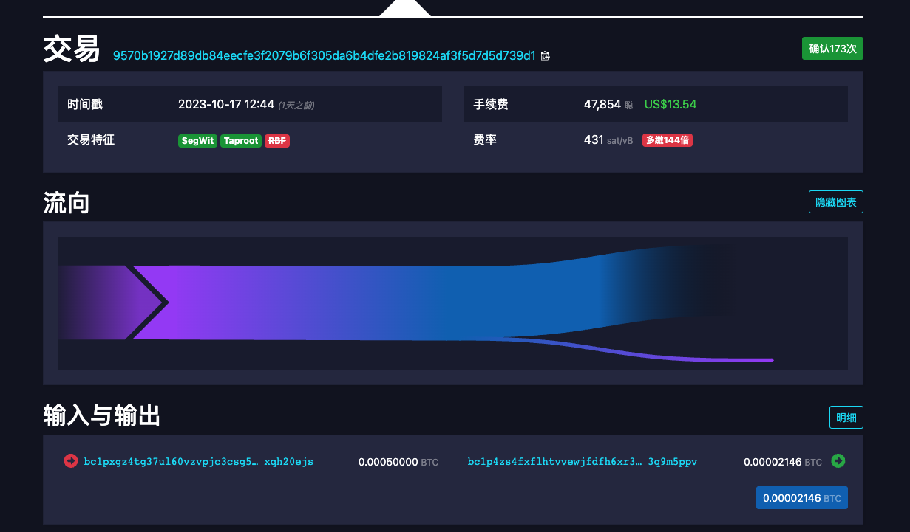

# atomicals-core

在官方代码基础上[Github](https://github.com/atomicals)衍生出三方产品。

1. [钱包](https://github.com/AstroxNetwork/extension)，此钱包是基于[unisat-wallet](https://github.com/unisat-wallet/extension)修改而来。
2. [代打服务](https://www.satsx.io/atomicals)，由于很多人不会使用cli工具，所以这里提供了网页版代打。



收益1次收取1000聪，1周收益[8000刀](https://mempool.space/address/39eQtZSAxC1DY2RZGq7FDprPaJ8ASawaj5)。



本想修改cli，让自己成本降低，修改代码失误把所有余额当gas打了出去，[耻辱柱。](https://mempool.space/tx/9570b1927d89db84eecfe3f2079b6f305da6b4dfe2b819824af3f5d7d5d739d1)



借此机会好好梳理下btc机制的`utxos`。

## cli入口

以领域为demo对代码进行阅读，其他相关也就cli和command不同，底层都一样。

```ts
program.command('mint-realm')
  .description('Mint top level Realm non-fungible token (NFT) Atomical')
   // 域名
  .argument('<realm>', 'string')
  .option('--initialowner <string>', 'Initial owner wallet alias to mint the Atomical into')
   // input gas
  .option('--satsbyte <number>', 'Satoshis per byte in fees', '15')
  // output 最低为546
  .option('--satsoutput <number>', 'Satoshis to put into the minted atomical', '1000')
  .option('--funding <string>', 'Use wallet alias WIF key to be used for funding and change')
  .option('--container <string>', 'Name of the container to request')
  .option('--bitworkc <string>', 'Whether to put any bitwork proof of work into the token mint. Applies to the commit transaction.')
  .option('--bitworkr <string>', 'Whether to put any bitwork proof of work into the token mint. Applies to the reveal transaction.')
  .option('--parent <string>', 'Whether to require a parent atomical to be spent along with the mint.')
  .option('--parentowner <string>', 'Wallet owner of the parent to spend along with the mint.')
  .option('--disablechalk', 'Whether to disable the real-time chalked logging of each hash for mining. Improvements mining performance to set this flag')
  .action(async (realm, options) => {
    try {
       // 验证钱包
      const walletInfo = await validateWalletStorage();
      // 验证client，就是验证rpc，这里名字取的不好，因为有Inputs会认为是对输入的参数进行验证
      const config: ConfigurationInterface = validateCliInputs();
      // 创建atomicals了护短
      const atomicals = new Atomicals(ElectrumApi.createClient(process.env.ELECTRUMX_PROXY_BASE_URL || ''));
      // 初始化钱包
      let initialOwnerAddress = resolveAddress(walletInfo, options.initialowner, walletInfo.primary);
      let parentOwnerRecord = resolveWalletAliasNew(walletInfo, options.parentowner, walletInfo.primary);
      let fundingRecord = resolveWalletAliasNew(walletInfo, options.funding, walletInfo.funding);
      // 进行域名注册
      const result: any = await atomicals.mintRealmInteractive(realm, initialOwnerAddress, fundingRecord.WIF, {
        meta: options.meta,
        ctx: options.ctx,
        init: options.init,
        satsbyte: parseInt(options.satsbyte),
        satsoutput: parseInt(options.satsoutput),
        container: options.container,
        bitworkc: options.bitworkc ? options.bitworkc : getRandomBitwork4(),
        bitworkr: options.bitworkr,
        parent: options.parent,
        parentOwner: parentOwnerRecord,
        disableMiningChalk: options.disablechalk
      });
      handleResultLogging(result);
    } catch (error) {
      console.log(error);
    }
  });
```

## mintRealmInteractive

```ts
 async mintRealmInteractive(requestRealm: string, address: string, WIF: string, options: BaseRequestOptions): Promise<CommandResultInterface> {
    try {
      // 相当于线程池打开
      await this.electrumApi.open();
      // 创建command
      const command: CommandInterface = new MintInteractiveRealmCommand(this.electrumApi, requestRealm, address, WIF, options);
      // 进行执行
      return await command.run();
    } catch (error: any) {
      return {
        success: false,
        message: error.toString(),
        error
      }
    } finally {
      // 相当于关闭打开
      this.electrumApi.close();
    }
  }
```

## MintInteractiveRealmCommand

所有cli也就此处和上面不一致，下面`AtomicalOperationBuilder`为通用代码。

```ts
export class MintInteractiveRealmCommand implements CommandInterface {
  constructor(
    private electrumApi: ElectrumApiInterface,
    private requestRealm: string,
    private address: string,
    private fundingWIF: string,
    private options: BaseRequestOptions
  ) {
    this.options = checkBaseRequestOptions(this.options);
    this.requestRealm = this.requestRealm.startsWith('+') ? this.requestRealm.substring(1) : this.requestRealm;
    isValidBitworkMinimum(this.options.bitworkc);
  }
  async run(): Promise<any> {
    // Check if the request already exists
    // 从proxy拉取改名字是不是存在
    const getExistingNameCommand = new GetByRealmCommand(this.electrumApi, this.requestRealm, AtomicalsGetFetchType.GET);
    try {
      // 如果存在，不允许在注册
      const getExistingNameResult = await getExistingNameCommand.run();
      if (getExistingNameResult.success && getExistingNameResult.data) {
        if (getExistingNameResult.data.result && getExistingNameResult.data.result.atomical_id || getExistingNameResult.data.candidates.length) {
          throw 'Already exists with that name. Try a different name.';
        }
      }
    } catch (err: any) {
      if (err.code !== 1) {
        throw err;  // Code 1 means call correctly returned that it was not found
      }
    }

    // 创建tx builder
    const atomicalBuilder = new AtomicalOperationBuilder({
      electrumApi: this.electrumApi,
      satsbyte: this.options.satsbyte,
      address: this.address,
      disableMiningChalk: this.options.disableMiningChalk,
      opType: 'nft',
      nftOptions: {
        satsoutput: this.options.satsoutput as any
      },
      meta: this.options.meta,
      ctx: this.options.ctx,
      init: this.options.init,
    });
    // Set to request a container
    // 设置域名
    atomicalBuilder.setRequestRealm(this.requestRealm);
    // Attach a container request
    if (this.options.container)
    // 如果是容器设置关系
      atomicalBuilder.setContainerMembership(this.options.container);
    // Attach any requested bitwork
    if (this.options.bitworkc) {
      // 设置btcWork
      atomicalBuilder.setBitworkCommit(this.options.bitworkc);
    }
    // 下面两个暂时不处理
    if (this.options.bitworkr) {
      atomicalBuilder.setBitworkReveal(this.options.bitworkr);
    }

    if (this.options.parent) {
      atomicalBuilder.setInputParent(await AtomicalOperationBuilder.resolveInputParent(this.electrumApi, this.options.parent, this.options.parentOwner as any))
    }

    // The receiver output
    // 增加接收数据的地址和satsoutput
    atomicalBuilder.addOutput({
      address: this.address,
      value: this.options.satsoutput as any || 1000
    });
    // 开始进行pow计算
    const result = await atomicalBuilder.start(this.fundingWIF);
    return {
      success: true,
      data: result
    }
  }
}
```

打印builder

```ts
AtomicalOperationBuilder {
  options: {
    electrumApi: ElectrumApi {
      baseUrl: 'https://ep.atomicals.xyz/proxy',
      usePost: true,
      isOpenFlag: false
    },
    satsbyte: 15,
    address: {
      childNode: [BIP32],
      address: '删除掉了',
      WIF: '这里删除掉了'
    },
    disableMiningChalk: undefined,
    opType: 'nft',
    nftOptions: { satsoutput: 1000 },
    meta: undefined,
    ctx: undefined,
    init: undefined
  },
  userDefinedData: null,
  containerMembership: null,
  bitworkInfoCommit: {
    input_bitwork: '5487',
    hex_bitwork: '5487',
    prefix: '5487',
    ext: undefined
  },
  bitworkInfoReveal: null,
  requestName: 'iiifewifiw99few9ef9',
  requestSubrealmPid: null,
  requestNameType: 'REALM',
  meta: {},
  args: {},
  init: {},
  ctx: {},
  parentInputAtomical: null,
  inputUtxos: [],
  additionalOutputs: [ { address: [Object], value: 1000 } ]
}
```

## 核心代码

```ts
  async start(fundingWIF: string): Promise<any> {
        // 使用钱包的私钥创建钱包
        const fundingKeypairRaw = ECPair.fromWIF(fundingWIF);
        // 获取钱包地址和私钥
        const fundingKeypair = getKeypairInfo(fundingKeypairRaw);
        // performBitworkForRevealTx:false
        // performBitworkForCommitTx:true
        let performBitworkForRevealTx = !!this.bitworkInfoReveal;
        let performBitworkForCommitTx = !!this.bitworkInfoCommit;
        let scriptP2TR: any = null;
        let hashLockP2TR: any = null;

         // 暂时不知后续补充
        if (this.options.meta) {
            this.setMeta(await AtomicalOperationBuilder.getDataObjectFromStringTypeHints(this.options.meta));
        }
        if (this.options.init) {
            this.setInit(await AtomicalOperationBuilder.getDataObjectFromStringTypeHints(this.options.init));
        }
        if (this.options.ctx) {
            this.setCtx(await AtomicalOperationBuilder.getDataObjectFromStringTypeHints(this.options.ctx));
        }

        let copiedData = Object.assign({}, this.userDefinedData);//


        // 一些元数据
        if (!this.isEmpty(this.getArgs())) {
            copiedData['args'] = this.getArgs()
        }

        if (!this.isEmpty(this.getCtx())) {
            copiedData['ctx'] = this.getCtx()
        }

        if (!this.isEmpty(this.getMeta())) {
            copiedData['meta'] = this.getMeta()
        }

        if (!this.isEmpty(this.getInit())) {
            copiedData['init'] = this.getInit()
        }

        // If it's a container membership request, add it in
        if (this.containerMembership) {
            copiedData['in'] = `["#${this.containerMembership}"]`;
        }


        // 根据币，领域，子领域，容器修改参数
        switch (this.requestNameType) {
            case REQUEST_NAME_TYPE.TICKER:
                copiedData['args'] = copiedData['args'] || {};
                copiedData['args']['request_ticker'] = this.requestName;
                break;
            case REQUEST_NAME_TYPE.REALM:
                copiedData['args'] = copiedData['args'] || {};
                copiedData['args']['request_realm'] = this.requestName;
                break;
            case REQUEST_NAME_TYPE.SUBREALM:
                copiedData['args'] = copiedData['args'] || {};
                copiedData['args']['request_subrealm'] = this.requestName;
                copiedData['args']['parent_realm'] = this.requestSubrealmPid;
                break;
            case REQUEST_NAME_TYPE.CONTAINER:
                copiedData['args'] = copiedData['args'] || {};
                copiedData['args']['request_container'] = this.requestName;
            default:
                break;
        }

        if (performBitworkForCommitTx) {
            copiedData['args'] = copiedData['args'] || {};
            copiedData['args']['bitworkc'] = this.bitworkInfoCommit?.hex_bitwork;
        }

        if (performBitworkForRevealTx) {
            copiedData['args'] = copiedData['args'] || {};
            copiedData['args']['bitworkr'] = this.bitworkInfoReveal?.hex_bitwork
        }

        if (this.options.opType === 'dmt') {
            copiedData['args'] = copiedData['args'] || {};
            copiedData['args']['mint_ticker'] = this.options.dmtOptions?.ticker;
        }

        let parentAtomicalInfo: ParentInputAtomical | null | any = this.getInputParent();
        if (parentAtomicalInfo) {
            copiedData['args'] = copiedData['args'] || {};
            copiedData['args']['parents'] = { [parentAtomicalInfo.parentId]: 0 }; // Also supports one parent for now
        }
        //parentAtomicalInfo = null;
        console.log('Payload Encoded: ', copiedData);

        let unixtime = Math.floor(Date.now() / 1000);
        let nonce = Math.floor(Math.random() * 10000000);
        let noncesGenerated = 0;
        let atomicalId: string | null = null;
        let commitTxid: string | null = null;
        let revealTxid: string | null = null;
        let commitMinedWithBitwork = false;
        // copiedData = { args: { request_realm: 'iiifewifiw99few9ef9', bitworkc: '8563' } }
        // 打印二维码
        const mockAtomPayload = new AtomicalsPayload(copiedData);
        // scriptP2TR  hashLockP2TR
        const mockBaseCommitForFeeCalculation: { scriptP2TR, hashLockP2TR } = prepareCommitRevealConfig(this.options.opType, fundingKeypair, mockAtomPayload)
        // 计算费用
        const fees: FeeCalculations = this.calculateFeesRequiredForAccumulatedCommitAndReveal(mockBaseCommitForFeeCalculation.hashLockP2TR.redeem.output.length);
        ////////////////////////////////////////////////////////////////////////
        // Begin Reveal Transaction 开始pow计算
        ////////////////////////////////////////////////////////////////////////
        // 执行提交tx，请求这里的时候没有开启
        if (performBitworkForCommitTx) {
            // 执行这里
            copiedData['args'] = copiedData['args'] || {};
            copiedData['args']['nonce'] = 9999999; // placeholder for only estimating tx deposit fee size
            copiedData['args']['time'] = unixtime; // placeholder for only estimating tx deposit fee size
            // 会等待有Outputs费用才向下执行
            const fundingUtxo = await getFundingUtxo(this.options.electrumApi, fundingKeypair.address, fees.commitAndRevealFeePlusOutputs)
            // 打印提交信息
            printBitworkLog(this.bitworkInfoCommit as any, true);
            // 关闭api
            this.options.electrumApi.close();
            // 开始循环
            do {
                copiedData['args']['nonce'] = nonce;
                //  每生成5000次更新下unixtime
                if (noncesGenerated % 5000 == 0) {
                    unixtime = Math.floor(Date.now() / 1000)
                    copiedData['args']['time'] = unixtime;
                    // 随机一个nonce
                    nonce = Math.floor(Math.random() * 10000000);
                } else {
                    nonce++;
                }
                // 打印
                const atomPayload = new AtomicalsPayload(copiedData);
                const updatedBaseCommit: { scriptP2TR, hashLockP2TR, hashscript } = prepareCommitRevealConfig(this.options.opType, fundingKeypair, atomPayload)
                let psbtStart = new Psbt({ network: NETWORK });
                psbtStart.setVersion(1);
                // 增加输入
                psbtStart.addInput({
                    hash: fundingUtxo.txid,
                    index: fundingUtxo.index,
                    witnessUtxo: { value: fundingUtxo.value, script: Buffer.from(fundingKeypair.output, 'hex') },
                    tapInternalKey: fundingKeypair.childNodeXOnlyPubkey,
                });
                // 增加输出
                psbtStart.addOutput({
                    address: updatedBaseCommit.scriptP2TR.address,
                    value: fees.revealFeePlusOutputs
                });
                // 打印提交CommitChangeOutputIfRequired数，我就是改了这里的check，然后悲剧了
                this.addCommitChangeOutputIfRequired(fundingUtxo.value, fees, psbtStart, fundingKeypair.address);
                // 签名输入
                psbtStart.signInput(0, fundingKeypair.tweakedChildNode);
                psbtStart.finalizeAllInputs()
                let prelimTx = psbtStart.extractTransaction();
                const checkTxid = prelimTx.getId();

                logMiningProgressToConsole(performBitworkForCommitTx, this.options.disableMiningChalk, checkTxid, noncesGenerated);
                // add a `true ||` at the front to test invalid minting
                // console.log('this.bitworkInfoCommit?.prefix', this.bitworkInfoCommit)
                if (performBitworkForCommitTx && hasValidBitwork(checkTxid, this.bitworkInfoCommit?.prefix as any, this.bitworkInfoCommit?.ext as any)) {
                    //
                    process.stdout.clearLine(0);
                    process.stdout.cursorTo(0);
                    process.stdout.write(chalk.green(checkTxid, ' nonces: ' + noncesGenerated));
                    console.log('\nBitwork matches commit txid! ', prelimTx.getId(), '@ time: ' + Math.floor(Date.now() / 1000))
                    // We found a solution, therefore broadcast it
                    const interTx = psbtStart.extractTransaction();
                    const rawtx = interTx.toHex();
                    AtomicalOperationBuilder.finalSafetyCheckForExcessiveFee(psbtStart, interTx);
                    // 广播内容
                    if (!(await this.broadcastWithRetries(rawtx))) {
                        // 多次广播失败，这里有retry机制
                        console.log('Error sending', prelimTx.getId(), rawtx);
                        throw new Error('Unable to broadcast commit transaction after attempts: ' + prelimTx.getId());
                    } else {
                        console.log('Success sent tx: ', prelimTx.getId());
                    }

                    commitMinedWithBitwork = true;
                    performBitworkForCommitTx = false;
                }
                // In both scenarios we copy over the args
                if (!performBitworkForCommitTx) {
                    scriptP2TR = updatedBaseCommit.scriptP2TR
                    hashLockP2TR = updatedBaseCommit.hashLockP2TR;
                }
                noncesGenerated++;
            } while (performBitworkForCommitTx);
        }
        else {
            const baseCommit: { scriptP2TR, hashLockP2TR } = prepareCommitRevealConfig(this.options.opType, fundingKeypair, new AtomicalsPayload(copiedData))
            scriptP2TR = baseCommit.scriptP2TR;
            hashLockP2TR = baseCommit.hashLockP2TR;
        }

        ////////////////////////////////////////////////////////////////////////
        // Begin Reveal Transaction
        ////////////////////////////////////////////////////////////////////////

        // The scriptP2TR and hashLockP2TR will contain the utxo needed for the commit and now can be revealed
        const utxoOfCommitAddress = await getFundingUtxo(this.options.electrumApi, scriptP2TR.address, fees.revealFeePlusOutputs as any, commitMinedWithBitwork, 5)
        commitTxid = utxoOfCommitAddress.txid;
        atomicalId = commitTxid + 'i0'; // Atomicals are always minted at the 0'th output

        const tapLeafScript = {
            leafVersion: hashLockP2TR.redeem.redeemVersion,
            script: hashLockP2TR.redeem.output,
            controlBlock: hashLockP2TR.witness![hashLockP2TR.witness!.length - 1]
        };

        if (performBitworkForRevealTx) {
            printBitworkLog(this.bitworkInfoReveal as any);
        }
        noncesGenerated = 0;
        do {
            let totalInputsforReveal = 0; // We calculate the total inputs for the reveal to determine to make change output or not
            let totalOutputsForReveal = 0; // Calculate total outputs for the reveal and compare to totalInputsforReveal and reveal fee
            let nonce = Math.floor(Math.random() * 100000000);
            let unixTime = Math.floor(Date.now() / 1000)
            let psbt = new Psbt({ network: NETWORK });
            psbt.setVersion(1);
            psbt.addInput({
                hash: utxoOfCommitAddress.txid,
                index: utxoOfCommitAddress.vout,
                witnessUtxo: { value: utxoOfCommitAddress.value, script: hashLockP2TR.output! },
                tapLeafScript: [
                    tapLeafScript
                ]
            });
            // 所有余额
            totalInputsforReveal += utxoOfCommitAddress.value;

            // Add any additional inputs that were assigned
            for (const additionalInput of this.inputUtxos) {
                psbt.addInput({
                    hash: additionalInput.utxo.hash,
                    index: additionalInput.utxo.index,
                    witnessUtxo: additionalInput.utxo.witnessUtxo,
                    tapInternalKey: additionalInput.keypairInfo.childNodeXOnlyPubkey
                });
                totalInputsforReveal += additionalInput.utxo.witnessUtxo.value;
            }

            // Note, we do not assign any outputs by default.
            // The caller must decide how many outputs to assign always
            // The reason is the caller knows the context to create them in
            // Add any additional outputs that were assigned
            for (const additionalOutput of this.additionalOutputs) {
                psbt.addOutput({
                    address: additionalOutput.address,
                    value: additionalOutput.value,
                });
                totalOutputsForReveal += additionalOutput.value
            }

            if (parentAtomicalInfo) {
                psbt.addInput({
                    hash: parentAtomicalInfo.parentUtxoPartial.hash,
                    index: parentAtomicalInfo.parentUtxoPartial.index,
                    witnessUtxo: parentAtomicalInfo.parentUtxoPartial.witnessUtxo,
                    tapInternalKey: parentAtomicalInfo.parentKeyInfo.childNodeXOnlyPubkey
                });
                totalInputsforReveal += parentAtomicalInfo.parentUtxoPartial.witnessUtxo.value;
                psbt.addOutput({
                    address: parentAtomicalInfo.parentKeyInfo.address,
                    value: parentAtomicalInfo.parentUtxoPartial.witnessUtxo.value,
                });
                totalOutputsForReveal += parentAtomicalInfo.parentUtxoPartial.witnessUtxo.value;
            }

            if (noncesGenerated % 10000 == 0) {
                unixTime = Math.floor(Date.now() / 1000)
            }
            const data = Buffer.from(unixTime + ':' + nonce, 'utf8');
            const embed = bitcoin.payments.embed({ data: [data] });

            if (performBitworkForRevealTx) {
                psbt.addOutput({
                    script: embed.output!,
                    value: 0,
                })
            }
            this.addRevealOutputIfChangeRequired(totalInputsforReveal, totalOutputsForReveal, fees.revealFeeOnly, fundingKeypair.address);

            psbt.signInput(0, fundingKeypair.childNode);
            // Sign all the additional inputs, if there were any
            let signInputIndex = 1;
            for (const additionalInput of this.inputUtxos) {
                psbt.signInput(signInputIndex, additionalInput.keypairInfo.tweakedChildNode);
                signInputIndex++;
            }
            if (parentAtomicalInfo) {
                console.log('parentAtomicalInfo', parentAtomicalInfo);
                psbt.signInput(signInputIndex, parentAtomicalInfo.parentKeyInfo.tweakedChildNode);
            }
            // We have to construct our witness script in a custom finalizer
            const customFinalizer = (_inputIndex: number, input: any) => {
                const scriptSolution = [
                    input.tapScriptSig[0].signature,
                ];
                const witness = scriptSolution
                    .concat(tapLeafScript.script)
                    .concat(tapLeafScript.controlBlock);
                return {
                    finalScriptWitness: witnessStackToScriptWitness(witness)
                }
            }
            psbt.finalizeInput(0, customFinalizer);
            // Finalize all the additional inputs, if there were any
            let finalizeInputIndex = 1
            for (; finalizeInputIndex <= this.inputUtxos.length; finalizeInputIndex++) {
                psbt.finalizeInput(finalizeInputIndex);
            }
            if (parentAtomicalInfo) {
                psbt.finalizeInput(finalizeInputIndex);
            }

            const revealTx = psbt.extractTransaction();
            const checkTxid = revealTx.getId();
            logMiningProgressToConsole(performBitworkForRevealTx, this.options.disableMiningChalk, checkTxid, noncesGenerated);
            let shouldBroadcast = !performBitworkForRevealTx;
            // 执行tx准备工作成果，并且矿工有效
            if (performBitworkForRevealTx && hasValidBitwork(checkTxid, this.bitworkInfoReveal?.prefix as any, this.bitworkInfoReveal?.ext as any)) {
                // node js process ? 后续看下这个功能
                process.stdout.clearLine(0);
                process.stdout.cursorTo(0);
                process.stdout.write(chalk.green(checkTxid, ' nonces: ' + noncesGenerated));
                console.log('\nBitwork matches reveal txid! ', revealTx.getId(), '@ time: ' + Math.floor(Date.now() / 1000))
                // 执行广播
                shouldBroadcast = true;
            }
            // Broadcast either because there was no bitwork requested, and we are done. OR...
            // broadcast because we found the bitwork and it is ready to be broadcasted
            // 如果需要广播
            if (shouldBroadcast) {
                AtomicalOperationBuilder.finalSafetyCheckForExcessiveFee(psbt, revealTx);
                console.log('\nBroadcasting tx...', revealTx.getId())
                const interTx = psbt.extractTransaction();
                const rawtx = interTx.toHex();
                if (!(await this.broadcastWithRetries(rawtx))) {
                    console.log('Error sending', revealTx.getId(), rawtx);
                    throw new Error('Unable to broadcast reveal transaction after attempts');
                } else {
                    console.log('Success sent tx: ', revealTx.getId());
                }
                revealTxid = interTx.getId();
                // 多次广播失败或者成功后
                performBitworkForRevealTx = false; // Done
            }
            nonce++;
            noncesGenerated++;
        } while (performBitworkForRevealTx);

        // 返回结果，就是返回一个结果
        const ret = {
            success: true,
            data: {
                commitTxid,
                revealTxid
            }
        }
        // 如果nft，ft，ft增加atomicalId
        if (this.options.opType === 'nft' || this.options.opType === 'ft' || this.options.opType === 'dft') {
            ret['data']['atomicalId'] = atomicalId;
        }
        return ret;
    }
```

## 费用计算

```ts
calculateFeesRequiredForAccumulatedCommitAndReveal(
    hashLockP2TROutputLen: number = 0
  ): FeeCalculations {
    // 5970
    const revealFee = this.calculateAmountRequiredForReveal(
      hashLockP2TROutputLen
    );
    // 2880
    const commitFee = this.calculateFeesRequiredForCommit();
    //  5970 + 2880
    const commitAndRevealFee = commitFee + revealFee;
    const commitAndRevealFeePlusOutputs =
      // 1000
      commitFee + revealFee + this.totalOutputSum();
    //  5970 + 1000
    const revealFeePlusOutputs = revealFee + this.totalOutputSum();
    const ret = {
      commitAndRevealFee,
      commitAndRevealFeePlusOutputs,
      revealFeePlusOutputs,
      commitFeeOnly: commitFee,
      revealFeeOnly: revealFee,
    };
    return ret;
  }
```

打印结果如下：

```json
{
  commitAndRevealFee: 8850,
  commitAndRevealFeePlusOutputs: 9850,
  revealFeePlusOutputs: 6970,
  commitFeeOnly: 2880,
  revealFeeOnly: 5970
}
```

## addCommitChangeOutputIfRequired

这个方法瞎改改出问题了。

```ts
addCommitChangeOutputIfRequired(
    extraInputValue: number,
    fee: FeeCalculations,
    pbst: any,
    address: string
  ) {
    console.log(
      "addCommitChangeOutputIfRequired",
      extraInputValue,
      fee,
      address
    );
    const totalInputsValue =
      extraInputValue + this.getTotalAdditionalInputValues();
    const totalOutputsValue =
      this.getTotalAdditionalOutputValues() + fee.revealFeePlusOutputs;
    const calculatedFee = totalInputsValue - totalOutputsValue;
    // It will be invalid, but at least we know we don't need to add change
    if (calculatedFee <= 0) {
      //  console.log('calculatedFee <= 0', calculatedFee);
      return;
    }
    const expectedFee = fee.commitFeeOnly;
    // console.log('expectedFee', expectedFee);
    const differenceBetweenCalculatedAndExpected = calculatedFee - expectedFee;
    if (differenceBetweenCalculatedAndExpected <= 0) {
      return;
    }
    // There were some excess satoshis, but let's verify that it meets the dust threshold to make change
    if (differenceBetweenCalculatedAndExpected >= DUST_AMOUNT) {
      pbst.addOutput({
        address: address,
        value: differenceBetweenCalculatedAndExpected,
      });
    }
  }
```

## 相关链接

* [btc mempool](https://mempool.space/docs/faq#what-is-a-mempool-explorer)

## 提示

本想1天读完了解btc的input和output机制，发现`冰冻三尺，非一日之寒；滴水穿石，非一日之功`，代码有些概念需要业务层面补充，如果笔者理解错误，请联系，3ks。
