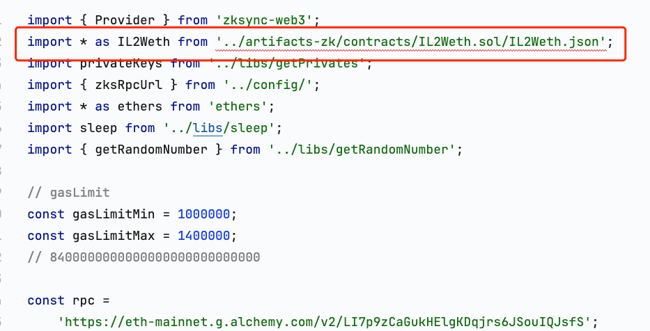
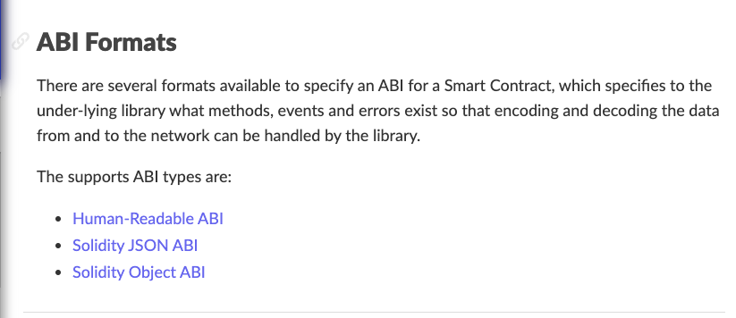

# Human-Readable ABI

进行开发时，一般使用`npx hardhat compile`后导入Abi，但是不够直观，正好找到一篇[文章](https://dev.to/anjana_j/how-to-convert-solidity-json-abi-to-human-readable-abi-in-hardhat-21mj)，这也算开发中小技巧，这里进行记录。



来看下`ethers`支持的几种格式[ABI Formats](https://docs.ethers.org/v5/api/utils/abi/formats/)



## 进行转换

```ts
import { ethers } from 'ethers';

async function main() {
    const jsonAbi =
        require('../artifacts-zk/contracts/IL2Weth.sol/IL2Weth.json').abi;
    const iface = new ethers.utils.Interface(jsonAbi);
    console.log(iface.format(ethers.utils.FormatTypes.full));
}

main().catch((error) => {
    console.error(error);
    process.exitCode = 1;
});
```

执行脚本`npx hardhat run ./scripts/convert-abi.ts`，输出结果为：

```txt
[
  'event Initialize(string name, string symbol, uint8 decimals)',
  'function allowance(address owner, address spender) view returns (uint256)',
  'function approve(address spender, uint256 value) returns (bool)',
  'function balanceOf(address account) view returns (uint256)',
  'function deposit() payable',
  'function depositTo(address _to) payable',
  'function withdraw(uint256 _amount)',
  'function withdrawTo(address _to, uint256 _amount)'
]
```

将打印ABI粘贴到代码中，然后删除无用的`ABI`。

```ts
import { ethers } from 'ethers';

async function main() {
    const jsonAbi =
        require('../artifacts-zk/contracts/IL2Weth.sol/IL2Weth.json').abi;
    const iface = new ethers.utils.Interface(jsonAbi);
    console.log(iface.format(ethers.utils.FormatTypes.full));
}

main().catch((error) => {
    console.error(error);
    process.exitCode = 1;
});

```

## 总结

* 使用人类可读abi可以删除无用提高效率。
* 知道当前脚本调用了那些abi。
