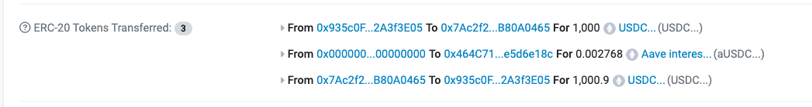

# FlashLoan

闪电贷是在不占用自有资金情况下最大限度获得利润的方式，常用场景为套利，本页面代码使用的是AAVE v2版本。

::: tip 代码
[代码地址](https://github.com/jspruance/aave-flash-loan-tutorial)
:::

## v2版本

[参考代码地址](https://github.com/jspruance/aave-flash-loan-tutorial/blob/main/aave-flash-loan-v2/contracts/FlashLoan.sol)，测试阶段发现没有命名`own`变量和在提现时无`token`变量，对其修正后代码如下：

```solidity

// SPDX-License-Identifier: UNLICENSED
pragma solidity 0.6.12;

import {FlashLoanReceiverBase} from "@aave/protocol-v2/contracts/flashloan/base/FlashLoanReceiverBase.sol";
import {ILendingPool} from "@aave/protocol-v2/contracts/interfaces/ILendingPool.sol";
import {ILendingPoolAddressesProvider} from "@aave/protocol-v2/contracts/interfaces/ILendingPoolAddressesProvider.sol";
import {IERC20} from "@aave/protocol-v2/contracts/dependencies/openzeppelin/contracts/IERC20.sol";

contract FlashLoan is FlashLoanReceiverBase {
    // 保存部署者
    address private immutable owner;

    constructor(
        address _addressProvider
    )
        public
        FlashLoanReceiverBase(ILendingPoolAddressesProvider(_addressProvider))
    {
        owner = msg.sender;
    }

    function executeOperation(
        address[] calldata assets,
        uint256[] calldata amounts,
        uint256[] calldata premiums,
        address /**initiator**/,
        bytes calldata /**params**/
    ) external override returns (bool) {
        // 迭代代币地址
        for (uint256 i = 0; i < assets.length; i++) {
            // 计算出每个代币地址的借贷和利息
            uint256 amountOwing = amounts[i].add(premiums[i]);
            // 授权给池子金额，这样池子能够拿代币
            IERC20(assets[i]).approve(address(LENDING_POOL), amountOwing);
        }
        return true;
    }

    function requestFlashLoan(address _token, uint256 _amount) public {
        address receiverAddress = address(this);
        // 代币地址
        address[] memory assets = new address[](1);
        assets[0] = _token;
        // 借贷数量
        uint256[] memory amounts = new uint256[](1);
        amounts[0] = _amount;
        // 0 = no debt, 1 = stable, 2 = variable
        uint256[] memory modes = new uint256[](1);
        modes[0] = 0;
        // 接收代币地址
        address onBehalfOf = address(this);
        LENDING_POOL.flashLoan(
            receiverAddress,
            assets,
            amounts,
            modes,
            onBehalfOf,
            "",
            0
        );
    }

    // 获取
    function getBalance(address _tokenAddress) external view returns (uint256) {
        return IERC20(_tokenAddress).balanceOf(address(this));
    }

    // 提款
    function withdraw(address _tokenAddress) external onlyOwner {
        IERC20(_tokenAddress).transfer(
            msg.sender,
            IERC20(_tokenAddress).balanceOf(address(this))
        );
    }

    // 权限
    modifier onlyOwner() {
        require(
            msg.sender == owner,
            "Only the contract owner can call this function"
        );
        _;
    }

    // 接收eth
    receive() external payable {}
}
```

### 对其部署

hardhat 配置如下：

```config
const config: HardhatUserConfig = {
  solidity: {
    version: "0.6.12",
  },
  networks: {
    goerli: {
      url: "https://ethereum-goerli.publicnode.com",
      accounts: [
        "私钥匙请自行配置",
      ],
    },
  },
};
```

开始进行部署，直接在[TestAddress](https://docs.aave.com/developers/deployed-contracts/v3-testnet-addresses)获取到了地址，部署代码如下：

```ts
import hre from "hardhat";

// v3地址：0xC911B590248d127aD18546B186cC6B324e99F02c
// v2地址：0x5E52dEc931FFb32f609681B8438A51c675cc232d
async function main() {
  console.log("deploying...");
  const FlashLoan = await hre.ethers.getContractFactory("FlashLoan");
  const flashLoan = await FlashLoan.deploy(
    "0xC911B590248d127aD18546B186cC6B324e99F02c"
    // 后面加了gas限制还是错误，然后意识到了这里使用的协议版本不对
    // {
    //   gasPrice: ethers.utils.parseUnits("100", "gwei"),
    //   gasLimit: 2100000,
    // }
  );
  await flashLoan.deployed();
  console.log("Flash loan contract deployed: ", flashLoan.address);
}

main().catch((error) => {
  console.error(error);
  process.exitCode = 1;
});

```

运行`npx hardhat run ./scripts/deploy.ts --network goerli`，运行后报错:

```ts
 cannot estimate gas; transaction may fail or may require manual gas limit [ See: https://links.ethers.org/v5-errors-UNPREDICTABLE_GAS_LIMIT ]
 reason: 'execution reverted',
 code: 'UNPREDICTABLE_GAS_LIMIT',
 method: 'estimateGas',
```

在代码中继续加入`gasPrice`后依然报错，错误如下：

```ts
  reason: 'execution reverted',
  code: 'UNPREDICTABLE_GAS_LIMIT',
  method: 'estimateGas',
```

排查发现是协议使用错误导致其构造函数出错，修改地址为v2版本则成功。

## 获取代码

[How to Build and Deploy Flashloan Contracts on Celo with Aave](https://celo.academy/t/how-to-build-and-deploy-flashloan-contracts-on-celo-with-aave/25) 参考这个文章。

在[0x9FD21bE27A2B059a288229361E2fA632D8D2d074](https://goerli.etherscan.io/address/0x9FD21bE27A2B059a288229361E2fA632D8D2d074)获取usdc。

```ts
import hre from "hardhat";
import { ethers } from "hardhat";

// v3地址：0xC911B590248d127aD18546B186cC6B324e99F02c
// v2地址：0x5E52dEc931FFb32f609681B8438A51c675cc232d

const usdcAbi = [
  "constructor(string name, string symbol, uint8 decimals)",
  "event Approval(address indexed owner, address indexed spender, uint256 value)",
  "event Transfer(address indexed from, address indexed to, uint256 value)",
  "function allowance(address owner, address spender) view returns (uint256)",
  "function approve(address spender, uint256 amount) returns (bool)",
  "function balanceOf(address account) view returns (uint256)",
  "function decimals() view returns (uint8)",
  "function decreaseAllowance(address spender, uint256 subtractedValue) returns (bool)",
  "function increaseAllowance(address spender, uint256 addedValue) returns (bool)",
  "function mint(uint256 value) returns (bool)",
  "function name() view returns (string)",
  "function symbol() view returns (string)",
  "function totalSupply() view returns (uint256)",
  "function transfer(address recipient, uint256 amount) returns (bool)",
  "function transferFrom(address sender, address recipient, uint256 amount) returns (bool)",
];

const abi = [
  "constructor(address _addressProvider)",
  "function ADDRESSES_PROVIDER() view returns (address)",
  "function LENDING_POOL() view returns (address)",
  "function executeOperation(address[] assets, uint256[] amounts, uint256[] premiums, address, bytes) returns (bool)",
  "function getBalance(address _tokenAddress) view returns (uint256)",
  "function requestFlashLoan(address _token, uint256 _amount)",
  "function withdraw(address _tokenAddress)",
];

const usdcAddress = "0x9FD21bE27A2B059a288229361E2fA632D8D2d074";
const v2FlashAddress = "0x5E52dEc931FFb32f609681B8438A51c675cc232d";
const mintMoney = 1000000000;
async function main() {
  // 获取账户
  const [owner] = await ethers.getSigners();
  // 获取合约
  const FlashLoan = await hre.ethers.getContractFactory("FlashLoan");
  // 部署合约
  const flashLoan = await FlashLoan.deploy(v2FlashAddress);
  await flashLoan.deployed();
  console.log("部署FlashLoanAddress" + flashLoan.address);
  const FlashLoanAddress = flashLoan.address;

  console.log("开始claim");
  // 领取usdc claim
  const usdcContract = new ethers.Contract(usdcAddress, usdcAbi, owner);
  const claim = {
    from: owner.address,
    to: usdcAddress,
    data: usdcContract.interface.encodeFunctionData("mint", [mintMoney]),
  };
  const transactionResponse = await owner.sendTransaction(claim);
  transactionResponse.wait();
  console.log("claim结果" + transactionResponse);

  const balanceOf = await usdcContract.balanceOf(owner.address);
  console.log("转账给flash loan金额" + balanceOf);

  const transferPara = {
    from: owner.address,
    to: usdcAddress,
    data: usdcContract.interface.encodeFunctionData("transfer", [
      FlashLoanAddress,
      balanceOf,
    ]),
  };
  const transferResult = await owner.sendTransaction(transferPara);
  transferResult.wait();
  console.log("转账成功，tx" + transferResult.hash);

  // 拿到flash合约
  const flashLoanContract = new ethers.Contract(flashLoan.address, abi, owner);
  // 创建参数
  const flashLoanParams = {
    from: owner.address,
    to: flashLoan.address,
    data: flashLoanContract.interface.encodeFunctionData("requestFlashLoan", [
      usdcAddress,
      mintMoney,
    ]),
  };
  // 进行借贷
  const flashLoanResult = await owner.sendTransaction(flashLoanParams);
  console.log(`Transaction hash: ${flashLoanResult.hash}`);
}

main().catch((error) => {
  console.error(error);
  process.exitCode = 1;
});


```

结果如下:



## 参考资料

* [doc Address](https://docs.aave.com/developers/core-contracts/pool#flashloan)
* [Markets](https://aave.com/)
* [TestAddress](https://docs.aave.com/developers/deployed-contracts/v3-testnet-addresses)
* [jspruance](https://www.youtube.com/watch?v=PtMs8FZJhkU)
* [BlockExplorerMedia](https://www.youtube.com/@BlockExplorerMedia)
