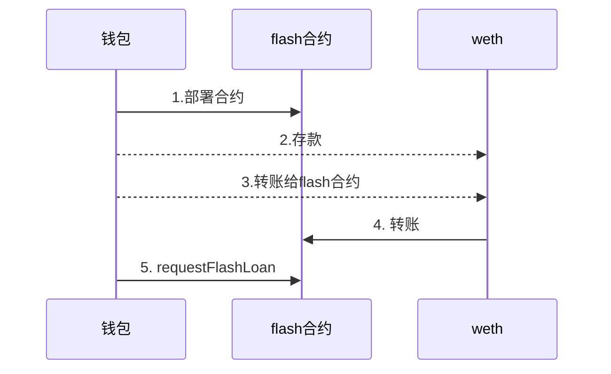

# FlashLoanV3

将V2版本升级到V3版本，代码如下：

```solidity
// contracts/FlashLoan.sol
// SPDX-License-Identifier: MIT
pragma solidity 0.8.10;

import {FlashLoanSimpleReceiverBase} from "@aave/core-v3/contracts/flashloan/base/FlashLoanSimpleReceiverBase.sol";
import {IPoolAddressesProvider} from "@aave/core-v3/contracts/interfaces/IPoolAddressesProvider.sol";
import {IERC20} from "@aave/core-v3/contracts/dependencies/openzeppelin/contracts/IERC20.sol";

contract FlashLoan is FlashLoanSimpleReceiverBase {
    address payable owner;

    constructor(
        address _addressProvider
    ) FlashLoanSimpleReceiverBase(IPoolAddressesProvider(_addressProvider)) {
        owner = payable(msg.sender);
    }

    function executeOperation(
        address asset,
        uint256 amount,
        uint256 premium,
        address /**initiator**/,
        bytes calldata /**params**/
    ) external override returns (bool) {
        // 允许池子可以还代币
        uint256 amountOwed = amount + premium;
        IERC20(asset).approve(address(POOL), amountOwed);
        return true;
    }

    function requestFlashLoan(address _token, uint256 _amount) public {
        POOL.flashLoanSimple(address(this), _token, _amount, "", 0);
    }

    function getBalance(address _tokenAddress) external view returns (uint256) {
        return IERC20(_tokenAddress).balanceOf(address(this));
    }

    function withdraw(address _tokenAddress) external onlyOwner {
        IERC20 token = IERC20(_tokenAddress);
        token.transfer(msg.sender, token.balanceOf(address(this)));
    }

    // 只有owner可以调用一些功能
    modifier onlyOwner() {
        require(
            msg.sender == owner,
            "Only the contract owner can call this function"
        );
        _;
    }

    // 可以接收eth
    receive() external payable {}
}
```

从代码中看到`executeOperation`已经从数组变成了单数据。

## 编写测试用例

测试用例主要流程为：



```ts
import { ethers } from "hardhat";
import { promisify } from "util";

// weth abi
const wethAbi = [
  "constructor(string mockName, string mockSymbol, address owner)",
  "event Approval(address indexed src, address indexed guy, uint256 wad)",
  "event Deposit(address indexed dst, uint256 wad)",
  "event OwnershipTransferred(address indexed previousOwner, address indexed newOwner)",
  "event Transfer(address indexed src, address indexed dst, uint256 wad)",
  "event Withdrawal(address indexed src, uint256 wad)",
  "function allowance(address, address) view returns (uint256)",
  "function approve(address guy, uint256 wad) returns (bool)",
  "function balanceOf(address) view returns (uint256)",
  "function decimals() view returns (uint8)",
  "function deposit() payable",
  "function mint(address account, uint256 value) returns (bool)",
  "function name() view returns (string)",
  "function owner() view returns (address)",
  "function renounceOwnership()",
  "function symbol() view returns (string)",
  "function totalSupply() view returns (uint256)",
  "function transfer(address dst, uint256 wad) returns (bool)",
  "function transferFrom(address src, address dst, uint256 wad) returns (bool)",
  "function transferOwnership(address newOwner)",
  "function withdraw(uint256 wad)",
];

// flashLoad abi
const flashLoanAbi = [
  "constructor(address _addressProvider)",
  "function ADDRESSES_PROVIDER() view returns (address)",
  "function POOL() view returns (address)",
  "function executeOperation(address asset, uint256 amount, uint256 premium, address, bytes) returns (bool)",
  "function getBalance(address _tokenAddress) view returns (uint256)",
  "function requestFlashLoan(address _token, uint256 _amount)",
  "function withdraw(address _tokenAddress)",
];

// https://docs.aave.com/developers/deployed-contracts/v3-testnet-addresses
const mintMoney = ethers.utils.parseEther("0.005");
const wethAddress = "0xCCB14936C2E000ED8393A571D15A2672537838Ad";

async function main() {
  // 1.部署合约
  const [owner] = await ethers.getSigners();

  // 部署合约
  const FlashLoan = await ethers.getContractFactory("FlashLoan");
  const FlashLoanDeploy = await FlashLoan.deploy(
    "0xC911B590248d127aD18546B186cC6B324e99F02c"
  );
  await FlashLoanDeploy.deployed();
  console.log("部署合约地址" + FlashLoanDeploy.address);

  // 2.存款
  console.log("开始存款");
  const wethContract = new ethers.Contract(wethAddress, wethAbi, owner);
  const depositPara = {
    from: owner.address,
    to: wethAddress,
    data: wethContract.interface.encodeFunctionData("deposit"),
    value: mintMoney,
  };
  const depositResult = await owner.sendTransaction(depositPara);
  depositResult.wait();
  console.log("存款成功，tx" + depositResult.hash);

  // 转账给flash合约
  const balanceOf = await wethContract.balanceOf(owner.address);
  console.log("转账给flash loan金额" + balanceOf);
  const withdrawPara = {
    from: owner.address,
    to: wethAddress,
    data: wethContract.interface.encodeFunctionData("transfer", [
      FlashLoanDeploy.address,
      balanceOf,
    ]),
  };
  const transResult = await owner.sendTransaction(withdrawPara);
  transResult.wait();
  console.log("转账成功，tx" + transResult.hash);

  console.log("开始借贷");
  const flashLoanContract = new ethers.Contract(
    FlashLoanDeploy.address,
    flashLoanAbi,
    owner
  );

  // 5. requestFlashLoan
  const flashLoanParams = {
    from: owner.address,
    to: FlashLoanDeploy.address,
    data: flashLoanContract.interface.encodeFunctionData("requestFlashLoan", [
      wethContract.address,
      mintMoney,
    ]),
  };
  const flashLoanResult = await owner.sendTransaction(flashLoanParams);
  flashLoanResult.wait();
  console.log(`Transaction hash: ${flashLoanResult.hash}`);
}

main().catch((error) => {
  console.error(error);
  process.exitCode = 1;
});

```

使用脚本`npx hardhat run ./scripts/deploy.ts --network goerli`执行，出现错误：

```ts
 cannot estimate gas; transaction may fail or may require manual gas limit
  reason: 'execution reverted',
  code: 'UNPREDICTABLE_GAS_LIMIT',
  method: 'estimateGas',
```

在执行时还会出现`NONCE_EXPIRED`，排查[文档](https://docs.ethers.org/v5/troubleshooting/errors/#help-REPLACEMENT_UNDERPRICED)有以下提示：

::: tip
Each Ethereum transaction requires a nonce property equal to the index of that transaction for that account for all time. So, if an account has send four transactions over its lifetime, that means the nonces 0 though 3 (inclusive) have been used. The next transaction must use a nonce of 4. Attempting to re-use a nonce less than 4 will result in this error.
:::

重新提出来flashLoanAddress，执行脚本，一次成功，这里卡了2h。

```ts
import { ethers } from "hardhat";
const flashLoanAbi = [
  "constructor(address _addressProvider)",
  "function ADDRESSES_PROVIDER() view returns (address)",
  "function POOL() view returns (address)",
  "function executeOperation(address asset, uint256 amount, uint256 premium, address, bytes) returns (bool)",
  "function getBalance(address _tokenAddress) view returns (uint256)",
  "function requestFlashLoan(address _token, uint256 _amount)",
  "function withdraw(address _tokenAddress)",
];

// https://docs.aave.com/developers/deployed-contracts/v3-testnet-addresses
const mintMoney = ethers.utils.parseEther("0.005");
const wethAddress = "0xCCB14936C2E000ED8393A571D15A2672537838Ad";
// 修改为flashLoanAddress地址
const flashLoanAddress = "修改为flashLoanAddress地址";

async function main() {
  const [owner] = await ethers.getSigners();

  const flashLoanContract = new ethers.Contract(
    flashLoanAddress,
    flashLoanAbi,
    owner
  );

  const flashLoanParams = {
    from: owner.address,
    to: flashLoanAddress,
    data: flashLoanContract.interface.encodeFunctionData("requestFlashLoan", [
      wethAddress,
      mintMoney,
    ]),
  };
  const flashLoanResult = await owner.sendTransaction(flashLoanParams);
  flashLoanResult.wait();
  console.log(`Transaction hash: ${flashLoanResult.hash}`);
}

main().catch((error) => {
  console.error(error);
  process.exitCode = 1;
});

```

## 提示

在[v3-testnet-addresses](https://docs.aave.com/developers/deployed-contracts/v3-testnet-addresses)拿到的Mintable address都有owner权限，所以这里使用了`WETH-TestnetMintableERC20-Aave`进行存款处理，并按照真实协议进行存款取款。

```ts
Mintable Reserves and Rewards
┌────────────────────────────────┬──────────────────────────────────────────────┐
│            (index)             │                   address                    │
├────────────────────────────────┼──────────────────────────────────────────────┤
│ DAI-TestnetMintableERC20-Aave  │ '0xBa8DCeD3512925e52FE67b1b5329187589072A55' │
│ LINK-TestnetMintableERC20-Aave │ '0xe9c4393a23246293a8D31BF7ab68c17d4CF90A29' │
│ USDC-TestnetMintableERC20-Aave │ '0x65aFADD39029741B3b8f0756952C74678c9cEC93' │
│ WBTC-TestnetMintableERC20-Aave │ '0x45AC379F019E48ca5dAC02E54F406F99F5088099' │
│ USDT-TestnetMintableERC20-Aave │ '0x2E8D98fd126a32362F2Bd8aA427E59a1ec63F780' │
│ AAVE-TestnetMintableERC20-Aave │ '0x8153A21dFeB1F67024aA6C6e611432900FF3dcb9' │
│ EURS-TestnetMintableERC20-Aave │ '0xBC33cfbD55EA6e5B97C6da26F11160ae82216E2b' │
│ WETH-TestnetMintableERC20-Aave │ '0xCCB14936C2E000ED8393A571D15A2672537838Ad' │
└────────────────────────────────┴──────────────────────────────────────────────┘
```
